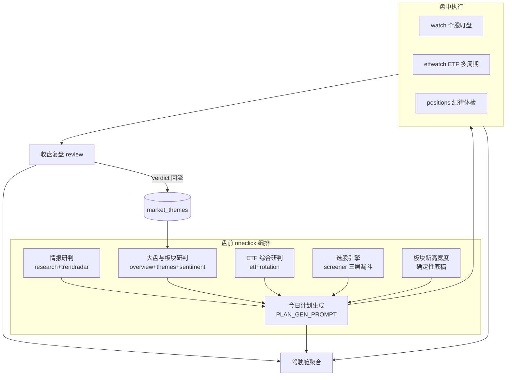
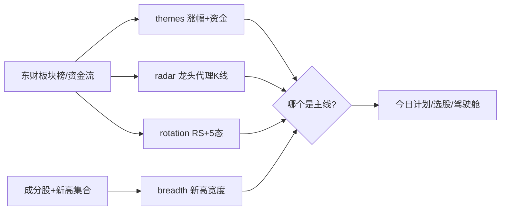
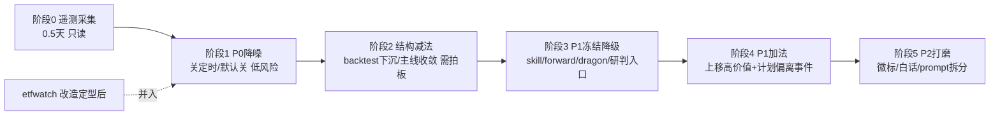

# stock-agent 优化期全模块审视报告

> 审视时间：2026-06-23 ｜ 视角：金融专家 + 软件专家 ｜ 范围：全后端模块 + 模块联动
> 原则：本报告只做评估、不改业务代码。ETF 多周期盯盘（`etfwatch`）处于改造期，评估见末节并标「暂定」。

## 审视框架

每个模块从四个角度过一遍：

- **[金融]**：在用户实际打法（A 股中线主升浪、ETF 锁强赛道 → 赛道内下钻龙头、短线不上仓位）下是否真有用？是否符合交易常识？指标有无误导性？
- **[软件]**：复杂度 / 重复度 / 耦合度？是否「删除即下线」干净？维护负担与取数成本？
- **[联动]**：与上下游是否重复产出？口径是否一致？是否多入口做同一件事？
- **结论**：`减法` / `加法` / `保持` + 理由 + 优先级。

## 结论与优先级图例

| 标记 | 含义 |
|---|---|
| `减法` | 过度设计 / 重复 / 维护成本 > 收益，建议删除、合并或降级 |
| `加法` | 缺关键功能或关键金融专业知识，建议补强 |
| `保持` | 当前合理，维持现状 |
| **P0** | 高优先级：直接影响决策质量或维护负担，建议尽快处理 |
| **P1** | 中优先级：有明确收益，排期处理 |
| **P2** | 低优先级：锦上添花 / 长期 |

---

## 一、大盘分析簇（9 模块）

涉及：[`market/overview`](backend/src/market/overview.ts) · [`sentiment`](backend/src/sentiment/service.ts) · [`breadth`](backend/src/breadth/service.ts) · [`radar`](backend/src/radar/service.ts) · [`rotation`](backend/src/rotation/service.ts) · [`themes`](backend/src/themes/service.ts) · [`dragon`](backend/src/dragon/service.ts) · [`capital`](backend/src/capital/service.ts) · [`cockpit`](backend/src/cockpit/service.ts)。

### 核心发现：存在「四套并行的板块/主线判定引擎」（最大过度设计）

这是本簇最关键的问题。当前有 **4 个模块各自从不同口径回答「哪个板块是主线」**，彼此独立取数、各算一套强度公式，且结论可能互相打架：

| 引擎 | 口径 | 强度公式 | 取数成本 |
|---|---|---|---|
| `themes.ingestFromBoards` | 涨幅榜排名 + 主力净流入 + 60日 | `rankScore + flowBonus + midBonus`（42-98） | 中（4 次榜单 + 资金流） |
| `radar.computeIndustryRadar` | 龙头代理 K 线均线趋势 + 动量 + 板块60日 | `base(趋势) + momPart + midPart + devPart` | 高（≤48 板块逐个拉日 K） |
| `rotation.buildRotationOverview` | 相对沪深300 RS + 5态 + 周线 + 资金流 | `base(5态) + rsPart + momPart + flowPart` | 高（universe 逐个拉日 K/周 K） |
| `breadth.buildBreadthOverview` | 板块内创新高个股数横向排名 + 持续性 | 计数排名（非打分） | 很高（逐板块拉成分股 + 全市场新高集合） |

- **[金融]** 四套口径在「主升浪 ETF 锁赛道」这一个目标上高度同质，但容易给出**不一致甚至冲突的主线名单**（涨幅榜热 ≠ 新高宽度持续 ≠ RS 跑赢）。用户无量化背景，面对 4 张不同的「主线榜」难以判断该信哪个，反而增加决策噪声。金融上最贴「中线主升浪」的是 `breadth`（新高持续性）+ `rotation`（RS 跑赢基准）+ `sentiment`（择时），这三者口径正交、互补；`themes`（涨幅榜+资金流叠加）和 `radar`（龙头代理 K 线）则与前者大面积重叠且更偏短期情绪。
- **[软件]** 4 套引擎重复调用 `getSectorRanking('industry'|'concept', *, 'today'|'mid60')`、重复跑 `computeMetrics`，对 aktools/东财造成 4 倍冗余取数压力；强度公式各有一套魔法系数（`themes` 的 `rankScore+flowBonus+midBonus`、`radar` 的四段加权、`rotation` 的四段加权），是 4 处独立的待维护「准量化逻辑」。
- **[联动]** `themes` 已把 `radar`/复盘/热点的判断都往 `market_themes` 沉淀，本意是「统一真相」，但 `radar` 和 `rotation` 仍各自对外提供榜单，统一并未真正发生。

**结论：`减法`（P0）** —— 收敛为「主线判定 = breadth + rotation + sentiment 三正交信号」，把 `radar.computeIndustryRadar` 的行业强弱榜与 `themes.ingestFromBoards` 的涨幅榜叠加择一保留（建议保留 `themes` 作为唯一「板块主线沉淀」，因为它已是多源归并的落库真相，`radar` 行业强弱可改为读 `themes` + `breadth` 而非自己重算 K 线）。这样既降一半取数量，又消除「多榜打架」。具体合并方案放到联动专章与优先级表。

### 逐模块结论

- [`market/overview`](backend/src/market/overview.ts) ·盘面快照聚合（~13 东财接口，60s 缓存）：**[金融]** 指数/外盘/资金/连板梯队齐全，是复盘与计划的事实底稿，必要。**[软件]** `safe()` 逐块降级、缓存合理，`buildMarketBoardPrompt` 已把「大盘复盘 + 板块主线 + 期货外盘」合并为单次 agent，避免了重复。**结论：`保持`**。唯一可优化：prompt 极长（约两屏指令），可读性差，属 P2。
- [`sentiment`](backend/src/sentiment/service.ts) ·情绪指数 0-100：**[金融]** 6 分项（广度/活跃/涨停强度/连板高度/炸板率/跌停恐慌）透明加权，按可用项重归一，零量化术语、白话仓位倾向，正是用户偏好的「不需量化知识即可维护」。作为 S1 择时总开关合理。**结论：`保持`**（P0 价值锚点，勿动）。
- [`breadth`](backend/src/breadth/service.ts) ·新高宽度主线：**[金融]** 「板块内创新高个股数 + 持续多日居首」是识别中线主升浪主线最朴素可靠的确定性判据，契合打法，用户专门要的能力。**[软件]** 取数最重（逐板块拉成分股 × 全市场新高集合），已用 `mapLimit` 并发限流；存在「当日口径」与「中长期口径（`formatMidlineBreadthForEtf`）」两套阈值常量，后者服务 etfwatch。**结论：`保持`**，但成本需在数据源层关注（见联动专章「取数预算」）。
- [`rotation`](backend/src/rotation/service.ts) ·ETF 行业轮动 + M2 下钻：**[金融]** RS（跑赢沪深300）+ 5态（含过热/破位惩罚）是中线赛道轮动的高质量判据，且 `runMidDrilldown` 实现了「强赛道 → 成分股 → 选股龙头」的核心打法闭环，价值高。**结论：`保持`**（P0 打法主干）。
- [`radar`](backend/src/radar/service.ts) ·中线雷达：**[金融]** 行业强弱 + 持仓趋势 + 中线候选池。其中「持仓趋势跟随建议」有独立价值（针对真实持仓给 MA60 跟随），但「行业强弱榜」与 `themes`/`rotation` 重叠，「中线候选池（行业龙头 + ETF）」与 `rotation` 的下钻 + `screener` 重叠。**结论：`减法`（P1）** —— 拆分：保留「持仓趋势」并入 `positions` 或 `cockpit`，行业强弱榜改读 `themes`，候选池交给 `rotation`/`screener`，整模块可瘦身或下线。
- [`dragon`](backend/src/dragon/service.ts) ·连板梯队龙头：**[金融]** 连板梯队是**短线游资情绪**指标。用户明确「短线不敢上仓位、核心是中线主升浪」，该模块与实际打法错位；其唯一中线用途（情绪温度）已被 `sentiment` 覆盖。**[软件]** service 是 `getDragonRanking` 薄封装，但仍是「模块 + 页面 + agent 工具 + 调度」一整套表面积。**结论：`减法`（P1）** —— 降级为 `sentiment` 的数据子项或仅保留 agent 工具，撤掉独立模块/页面。
- [`capital`](backend/src/capital/service.ts) ·龙虎榜资金面：**[金融]** 龙虎榜席位（游资/机构）同样偏短线打板视角，对中线 ETF 打法边际价值低。**[软件]** 薄封装（datacenter + akshare 席位）。**结论：`减法`（P1）** —— 同 `dragon`，降级为按需 agent 工具，不必常驻模块。
- [`cockpit`](backend/src/cockpit/service.ts) ·驾驶舱：**[金融]** 一屏聚合「安全/计划兑现/强主线/各模块最新产出/选股候选/事件时间线」，是执行纪律落地的好抓手（用户当前瓶颈正是执行与闭环）。**[软件]** 纯本地 DB 只读、不重算、秒开，设计干净。**结论：`保持`**（P0 价值）。可加法：事件时间线目前合并 discipline/trade/watch/decision 四类，可补「计划偏离」事件（见联动专章）。

### 本簇小结

- `减法` 候选：`radar`（拆分瘦身）、`dragon`、`capital`（降级为工具）—— 四套主线引擎收敛为三正交信号。
- `保持`：`overview`、`sentiment`、`breadth`、`rotation`、`cockpit`。
- 收益：减约一半冗余板块取数；消除「多主线榜打架」对无量化背景用户的决策噪声。

---

## 二、量化能力簇（5 模块）

涉及：[`strategy/sim`](backend/src/strategy/sim.ts) · [`strategy/skill`](backend/src/strategy/skill.ts) · [`strategy/forwardModule`](backend/src/strategy/forwardModule.ts)(+`forward`/`rebalance`) · [`strategy/miaoxiangSync`](backend/src/strategy/miaoxiangSync.ts) · [`backtest`](backend/src/backtest/service.ts)。

### 核心发现：本簇与「无量化背景 + 执行纪律是真瓶颈」的画像最不匹配

用户画像明确：**无量化背景，不熟悉因子/IC/回测等概念，偏好不需量化知识即可维护**；且自评**当前瓶颈在执行纪律与结果闭环，不在信息多寡**。本簇恰恰是全系统「量化味」最重、维护门槛最高、与实际打法（ETF 主线 + 手动纪律执行）最远的一簇。

### 逐模块结论

- [`strategy/sim`](backend/src/strategy/sim.ts) ·模拟交易引擎：**[金融]** 一个本地纸上账户，强校验 A 股通用规则（涨停不可买/跌停不可卖、T+1、100 股整数倍、资金/可卖充足），用来「记录决策 + 事后复盘兑现」非常契合「练执行纪律」。**[软件]** 纯本地库、规则清晰、`assertTradeAllowed` 统一过安全闸，质量高。**结论：`保持`**（作为「模拟盘记录器」是闭环的好载体）。
- [`strategy/skill`](backend/src/strategy/skill.ts) ·三维度打法自迭代：**[金融]** 让 LLM 在复盘时对「选股/买入/卖出」三维度提 prompt 修订提案、用户审批后版本化生效、可回滚。理念先进，但对单人无量化用户：①「让 AI 自己改自己的打法」很难产生稳定正向 alpha，更多是 prompt 漂移；②三维度 × 版本链 × 提案审批 是不小的认知与操作负担。**[软件]** 代码本身干净（追加式版本、事务化审批/回滚），但它是「模块 + 页面 + 工具(`propose_skill_update`) + 注入 system prompt」的一整套机制。**结论：`减法`（P1）** —— 建议「冻结而非删除」：默认 `skillEnabled=false`（保留手动编辑 playbook 的能力），停用 AI 自动提案链路，待有足够样本与精力再开。
- [`strategy/forwardModule`](backend/src/strategy/forwardModule.ts)（+`forward`/`rebalance`）·前向验证 + 自动调仓：**[金融]** 产出「累计收益 + 最大回撤 + 胜率 + Alpha + 闸门」——其中**Alpha/最大回撤正是用户明确不熟的量化指标**；`rebalance` 的「diff 持仓 vs TopN → 自动建仓」把系统推向「自动交易」，与用户「短线不上仓位、重手动纪律」的诉求方向相反（虽默认双闸全关）。**[软件]** 自动建仓链路（全局总闸 + 单战法白名单 + `executeSimTrade` 兜底）安全设计到位，但维护面大。**结论：`减法`（P1）** —— 前向统计**只保留白话口径**（累计收益率、胜率、最大回撤可改叫「最大回撤幅度」并配一句话解释），隐藏 Alpha 等术语；`rebalance` 自动建仓链路建议长期冻结或下线（保留手动模拟下单即可）。
- [`strategy/miaoxiangSync`](backend/src/strategy/miaoxiangSync.ts) ·妙想镜像同步：**[金融]** 把妙想模拟盘账户镜像进来，便于统一看持仓/复盘。若用户实际在用妙想模拟盘则有价值，否则是悬空依赖。**[软件]** 同步覆盖式、镜像账户只读，设计合理。**结论：`保持（条件）`（P2）** —— 取决于是否仍用妙想；不用则随 `dragon/capital` 一起做减法。
- [`backtest`](backend/src/backtest/service.ts) ·信号级/组合级回测：**[金融]** 基于 `tradelab` 的完整回测：Sharpe、profitFactor、最大回撤、ATR 跟踪止盈、组合权重……**这是全系统最典型的「需要量化知识才能正确解读与维护」的模块**，与用户画像直接冲突。回测对「中线主升浪 ETF 锁赛道」这种依赖主观主线判断 + 纪律执行的打法，指导意义也有限（历史信号回测≠未来主线把握）。**[软件]** 依赖第三方 `tradelab` 库，口径转换（小数/百分数、winRate 归一）已有踩坑痕迹，是一块独立的高维护成本资产。**结论：`减法`（P0 候选）** —— 建议从主动线收起：要么整模块下线，要么降为「设置页高级实验」入口默认隐藏。这是本次「做减法」收益最大、最贴合画像的一刀。

### 本簇小结

- 强 `减法` 信号：`backtest`（P0 候选下线/隐藏）、`strategy/skill` 自动提案链（P1 冻结）、`forward` 的 Alpha + `rebalance` 自动建仓（P1 冻结/白话化）。
- `保持`：`strategy/sim`（作模拟盘记录器）。
- `保持（条件）`：`miaoxiangSync`（取决于是否在用妙想）。
- 取舍主张：把「量化实验室」收敛为「一个能练纪律的模拟盘 + 白话绩效回顾」，删掉需要量化知识维护的部分，正面回应用户画像。**注意：这些模块可能是有意搭建的，建议作为「建议项」由用户拍板，而非默认删除。**

---

## 三、选股簇（screener）

涉及：[`screener/service`](backend/src/screener/service.ts)（编排）· [`screener/engines`](backend/src/screener/engines.ts)（multifactor 三层漏斗 + nl 链路）及其 `filter`/`scorer`/`ranker`/`risk`/`trend`/`dragon`/`nlEngine` 子件。

### 评估

- **[金融]** `multifactor` 漏斗（全市场快照 → 规则硬筛剔科创/北交/ST → 多因子打分[估值/流动性/市值/动量/活跃度/题材热度] → LLM 横排给 thesis → 行业去集中 → TopN）是**工程化而非学术化**的选股，因子直观、且用 LLM 横排把分数翻译成「一句话逻辑 + 风险标签 + 失效条件」，对无量化用户友好度远高于回测模块。另有 `nl`（自然语言选股）链路，完全契合「不需量化知识」的偏好。**结论：`保持`**（P0 价值，是「赛道内下钻龙头」的执行器）。
- **[软件]** 架构是本项目的范式标杆：`runScreen` 统一编排 + `ScreenEngine` 注册表 + 逐级硬筛兜底（full → skipVolumePrice → tradableOnly）+ 盘前退化用上一交易日收盘快照兜底 + 二段增强仅对收窄后候选池限量取数（避免全市场逐只）。降级链路考虑周到。**结论：`保持`**。
- **[联动]** 复用度高且正确：[`rotation.runMidDrilldown`](backend/src/rotation/service.ts) → `runScreen({strategyId:'mid_leader', horizon:'mid', universe:成分股})` 实现 ETF→个股下钻；[`plan/oneclick`](backend/src/plan/oneclick.ts) 与 [`strategy/rebalance`](backend/src/strategy/rebalance.ts) 也复用同一 `runScreen`。这是「一个能力多处复用」的正面案例，与大盘簇「同能力多处重算」恰好相反。

### 注意点（非减法，是耦合提示）

- `dragonRank` 二段因子依赖 [`screener/dragon`](backend/src/screener/dragon.ts)→涨停池，与第一簇拟降级的 `dragon` 模块同源。**若对 `dragon` 做减法，需确认含 `dragonRank` 因子的选股策略仍有数据来源**（二者可共用底层 `getDragonRanking`，降级的是「独立模块/页面」而非取数函数，故通常不受影响——执行时核对即可）。**优先级 P1 核对项**。
- 因子名仍偏术语（动量/活跃度等）。**[加法建议 P2]** 选股结果页对每个因子加一句白话 tooltip，降低无量化用户的理解门槛。

**结论：`保持`**（全簇）。这是系统里最该保留并继续作为「主干执行器」的一簇。

---

## 四、AI 研判簇

涉及：[`analyze`](backend/src/analyze/index.ts)（公共 AI 分析中心）· [`decision`](backend/src/decision/index.ts)（多智能体辩论 + 卖点检查 + 反思）· `market/review`（已并入「大盘与板块研判」）· `watchlist :code/analyze` 与 `watchlist/analyze`（server.ts 内）· `chat`。

### 核心发现：「个股 AI 研判」存在 3 个轻重不一的并行入口

同一诉求「让 AI 看一只票该不该买/卖」，当前有三条路径：

| 入口 | 实现 | 重量 | 产出 |
|---|---|---|---|
| `watchlist :code/analyze` | 单 agent，`runTask`，`purpose=analyze` | 轻 | 一段研判文本 |
| `decision`（个股辩论） | 多角色分析师辩论 + 结构化裁决 + verdict 缓存 | 重（多轮多 agent，token 高） | 辩论叙事 + 结构化裁决 |
| `analyze` kinds（个股类 kind，如有） | 经统一 hub 的单 agent | 轻 | 落 ai_analyses |

- **[金融]** 对中线 ETF 打法，「个股」研判本就不是主战场（主战场是 ETF 主线 + 赛道下钻）。三个入口里，**多智能体辩论的真正高价值场景是「持仓卖点决策」**（对立视角能抑制单模型偏置、帮用户守纪律），而盘前快速看一眼某票用轻量入口足矣。三套并行 = 选择过载 + token 浪费。
- **[软件]** `analyze` 作为统一 hub（kinds 注册表 + `/ws/analyze` 通用流式 + `/api/analyses` 目录与历史）设计优秀，`decision` 也正确地把历史复用 `ai_analyses`（不另开历史接口），避免了存储层重复。问题不在代码质量，而在**对用户暴露了过多做同类事的入口**。

### 逐模块结论

- [`analyze`](backend/src/analyze/index.ts) ·公共 AI 分析中心：**[金融+软件]** 「一处发起 + 看全部历史结论」，是驾驶舱聚合各 AI 产出的底座，统一了流式/落库/中止/超时部分结论保存。**结论：`保持`**（P0 范式底座）。建议把所有零散 AI 研判都收编为它的 kind（见下）。
- [`decision`](backend/src/decision/index.ts) ·多智能体辩论：**[金融]** 个股/股指/ETF 三链路 + 盘中/日终/ETF 三个卖点检查 cron + 反思（算个股 vs CSI300 Alpha）。其中**ETF 卖点复核 + 持仓辩论卖点检查最贴打法**，应保留；**个股辩论与 watchlist 轻研判重叠**；**reflection 的 Alpha 又是用户不熟的量化指标**。**[软件]** 角色治理（职责覆盖/启停/引擎参数）是一套不小的可配置面。**结论：`减法`（P1）** —— ①保留 ETF/持仓卖点辩论；②个股辩论与 watchlist 轻研判二选一收敛（建议：快速看用轻研判，重决策才上辩论，UI 上明确分流）；③reflection 的 Alpha 白话化或降级（与量化簇一致处理）。
- `watchlist :code/analyze` + `watchlist/analyze`（[server.ts](backend/src/server.ts:888)）·自选个股/组合轻研判：**[金融]** 轻量、契合「盘前快速扫一眼自选」。**[软件]** prompt 内联在 server.ts，与「AI 调用应收编到 analyze kind」的范式不一致。**结论：`减法`（P2）** —— 迁移为 `analyze` 的一个 kind（`watchlist-analyze`），统一历史与入口，顺手给 server.ts 瘦身。
- `market/review`（[server.ts](backend/src/server.ts:354)）·一键大盘与板块研判：**[金融+软件]** 已把「大盘复盘 + 板块主线 + 期货外盘」合并为单次 agent，且共用 `buildMarketBoardPrompt`。**结论：`保持`**。
- [`chat`](backend/src/chat.ts) ·通用聊天：**[金融+软件]** 带工具的多轮通用对话，作兜底/探索入口合理，流式 + abort + 缓存键齐全。**结论：`保持`**。

### 本簇小结

- `减法`：收敛「个股研判」入口（P1）；`watchlist analyze` 迁为 `analyze` kind（P2）；`decision.reflection` Alpha 白话化（P1，与量化簇合并处理）。
- `保持`：`analyze` hub、`decision` 的 ETF/持仓卖点辩论、`market/review`、`chat`。
- 主张：保留「一个统一 AI 分析中心（analyze）」+「辩论只用于值得重决策的卖点场景」，砍掉同质的个股研判多入口。

---

## 五、个股实时盯盘（watch）

涉及：[`watch/engine`](backend/src/watch/engine.ts)（Pulse 轮询引擎）+ `rules`/`gate`/`dispatcher`/`reflect`/`digest`/`strategyProfile`/`volatility` 子件，[`watch/index`](backend/src/watch/index.ts) 暴露 `/api/watch/*` + `/ws/watch`。（`etfwatch` 见末节，本节不含。）

### 评估

- **[金融]** 交易时段常驻轮询（纯计算无 LLM），监控**自选 + 真实持仓 + 战法持仓**，命中信号经终审闸门 → Telegram。信号含：日内异动/涨停、收盘结算、**中线趋势破坏（周线/MA60）**、S9 中线指标转弱，且区分 short/mid 持仓周期。其中**「持仓中线趋势破坏告警」直接服务执行纪律（破位提醒离场）**，与打法高度契合，是高价值部分。日内 tick 级异动告警则偏短线，对「短线不上仓位」的用户价值较低、易构成噪声（虽已有 gate 终审 + 默认沉默抑制刷屏）。
- **[软件]** 工程质量高：坏价跳变过滤、跨日状态重置、周 K/指标当日缓存、gate 终审去重、dispatcher 重发、reflect 结果回评、daily digest 一应俱全，模块边界清晰（「删两行即下线」）。属「复杂但是必要复杂度」，非草率堆砌。
- **[联动]** 关键重叠：**「真实持仓卖点」被三处各看一遍** —— `watch`（实时趋势破坏/指标转弱告警）、`decision`（盘中/日终持仓辩论卖点检查 cron）、`positions`（确定性纪律体检）。三者口径与触发时机不同，但用户会在不同渠道收到关于同一持仓的多条卖点信号，存在告警疲劳与口径不一致风险。详见联动专章。

### 结论

- **`保持`（P0）**：持仓中线趋势破坏 / 指标转弱告警 + 自动卖出可见性，是盘中执行纪律的核心抓手。
- **`减法`（P2）**：评估日内 tick 异动类信号对本用户的实际价值，可考虑默认关闭纯短线异动告警，仅保留持仓/中线相关信号，降噪。
- **联动收敛（P1）**：把「真实持仓卖点」的三处来源在驾驶舱/告警层做去重与口径统一（见联动专章），避免三套引擎对同一持仓重复提醒。

---

## 六、情报 / 数据簇

涉及：[`trendradar`](backend/src/trendradar/index.ts)（热点雷达 MCP）· [`research`](backend/src/research/index.ts)（东财研报 + 公告）· [`cls`](backend/src/cls/index.ts)（财联社电报）· [`datasource/registry`](backend/src/datasource/registry.ts)（数据源注册中心，17 源）· 行情取数（`market/eastmoney` + tencent/sina/netease 兜底 + akshare + jisilu）。

### 评估：本簇是「已经做过减法」的正面样板

- **[联动/已优化]** `research` 与 `trendradar` 的每日 AI 研判**已合并为单一「情报研判」（8:00，研报机会 + 全网热点合一）**，并显式下线了 `trendradar` 的 `intel.daily` 避免双跑（见 [trendradar/index.ts](backend/src/trendradar/index.ts:24) 注释）。这正是本报告对大盘簇/AI 簇主张的「同能力合并」的范例，说明项目已有良性收敛意识。三者在前端也已折叠进单一「情报」页。
- [`trendradar`](backend/src/trendradar/index.ts)：**[金融]** 热榜/新闻/RSS + 周度研判，作消息面雷达合理；依赖群晖 TrendRadar MCP。**[软件]** 响应级 120s 缓存、容错齐全。**结论：`保持`**。
- [`research`](backend/src/research/index.ts)：**[金融]** 研报五类 + 公告 + 机构观点综述，对中线主线的「景气印证」有价值。**[软件]** 干净。**结论：`保持`**。**[加法 P2]** `themes.ingestFromResearch` 适配器仍是预留空实现（[themes/service.ts](backend/src/themes/service.ts:406)）——若希望研报成为主线沉淀的第四源，可接上；否则可删掉该预留注释减少误导。
- [`cls`](backend/src/cls/index.ts)：**[金融]** 财联社电报快讯，盘中消息面有用。**[软件]** 极薄（单端点 + 降级链 + 60s 缓存）。**结论：`保持`**。
- [`datasource/registry`](backend/src/datasource/registry.ts)：**[软件]** 17 源的单一元数据真相（分类/协议/凭据/启停/健康/统计），是全项目最值得保留的基础设施范式。**结论：`保持`**（P0 基础设施）。

### 减法点：外部「选股 / 资讯」源存在冗余

数据源里有多个**与本地 screener 或彼此重叠的外部能力**，疑似历史试接入后未收口：

- 选股类：`iwencai`（问财 ETF 选股）、`iwencai-stock`（问财个股，默认禁用）、`miaoxiang`（含选股）、`htsc`（华泰「条件选股」五技能之一）——叠加本地 `screener` 的 multifactor + nl，**至少 5 套选股能力**。
- 资讯类：`miaoxiang`、`htsc`、`xueqiu`（经 akshare）、`cls` 多源并存。

- **[金融]** 对单人中线 ETF 打法，本地 `screener`（含 nl 自然语言）+ `iwencai` ETF 选股基本够用；`htsc`、`iwencai-stock`、`xueqiu` 若未实际使用，是悬空的凭据与维护面。
- **[软件]** registry 条目本身很轻（声明式），但每个「就绪/健康检查/凭据」都是认知与排障负担，且 `htsc` 接入状态据记忆仍未完全落地。
- **结论：`减法`（P2）** —— 盘点 `htsc` / `iwencai-stock` / `xueqiu` / `miaoxiang` 选股的实际使用情况，未用的从 `SOURCES[]` 删除或保持禁用并标注「未启用」，收敛到「本地 screener + 必要外部源」。**这是核对类工作，需用户确认哪些在用。**

### 行情取数

- 4 行情兜底源（eastmoney → tencent → sina → netease）+ akshare + jisilu：**[金融/软件]** 对个人系统看似偏多，但行情是全系统命脉，多源 best-effort 兜底显著提升可用性（东财被重置时仍能出数），且都是声明式注册、按需降级。**结论：`保持`**。

### 本簇小结

- `保持`：trendradar / research / cls / datasource registry / 行情多源兜底。
- `减法`（P2）：盘点并裁撤未使用的外部选股/资讯源（htsc / iwencai-stock / xueqiu 等）。
- `加法`（P2）：接上 `research → themes` 第四源，或删除预留注释。
- 本簇整体健康，是「自包含模块 + 数据源单一真相」范式落地最好的部分。

---

## 七、执行闭环与系统簇

涉及：[`plan`](backend/src/plan/service.ts)（今日计划 + [oneclick 编排](backend/src/plan/oneclick.ts)）· [`positions`](backend/src/positions/discipline.ts)（持仓纪律）· [`review`](backend/src/review/index.ts)（收盘复盘）· [`safety`](backend/src/safety/guard.ts)（交易总闸）· [`etf`](backend/src/etf/index.ts)（ETF 主线）· `watchlist`/`thsFavorites`/`idingpan`（自选与写透）· 系统类（`scheduler`/`scheduling` · `tools` · `prompts` · `ops` · `usage` · `gateway`/`runner`）。

### 核心发现 1：盘前→盘中→收盘闭环完整且设计优秀

- [`plan/oneclick`](backend/src/plan/oneclick.ts) 一键编排（情报 → 大盘板块 →[ETF 研判 ‖ 选股]→ 计划生成，阶段间串行/阶段内并行、尽力而为）把上游六源刷新后生成结构化计划，盘中盯盘程序化对照、收盘复盘回填，**是整个系统的价值主轴，与用户「全链路 ETF 操作闭环」诉求高度吻合**。**[金融+软件] 结论：`保持`**（P0 主轴）。
- [`safety/guard`](backend/src/safety/guard.ts) 代码层交易总闸（kill switch / 自动开关 / 交易日时段，绝不依赖 prompt）：**[软件]** 安全设计教科书级，所有模拟/自动卖出落单前统一过闸。**结论：`保持`**（P0 安全底线）。
- [`positions/discipline`](backend/src/positions/discipline.ts) 持仓纪律体检（确定性算「该止损/止盈/超期/超配/总仓过重」，ETF 用更宽松趋势级阈值，按日去重推送）：**[金融]** 纯确定性、零量化、直接服务「执行纪律」这一真瓶颈，质量高。**结论：`保持`**（P0）。
- [`review`](backend/src/review/index.ts) 收盘深度复盘（结构化 JSON + 计划兑现度统计 + 回流主线 phase + TG 摘要）：**[金融+软件]** 闭环的「结果反馈」环节，且已合并原 market.review 推送职责。**结论：`保持`**（P0）。
- [`etf`](backend/src/etf/index.ts) ETF 主线模块（跟踪池 + 确定性 etf_signals + 综合研判，喂今日计划 ETF 基准）：**[金融]** 是用户真实大仓位主战场的承载模块，价值最高之一。**结论：`保持`**（P0）。
- 自选写透 `watchlist`/`thsFavorites`/`idingpan`：**[软件]** best-effort 单向/双向同步，失败不阻断主流程，设计正确。**结论：`保持`**（P2 视使用情况）。

### 核心发现 2：ETF「持仓卖点检查」被 4 处在临近时点重复执行（重要减法）

把定时表与盯盘/纪律叠起来看，**同一持仓 ETF 的卖点在每个交易日 14:45-16:00 区间被至少 4 套机制各查一遍**：

| 机制 | 时点 | 形态 |
|---|---|---|
| `etf.sellCheck`（[etf/index.ts](backend/src/etf/index.ts:101)） | 14:45 | agent 跑 ETF 盘中卖点检查，推 TG |
| `decision.sellcheck.etf`（[decision/index.ts](backend/src/decision/index.ts:228)） | 14:50 | 多 agent 辩论持仓 ETF 卖点，条件推 TG |
| `watch` 引擎 | 盘中实时 | 持仓 ETF 趋势破坏/指标转弱告警，推 TG |
| `positions` 纪律体检 | 盘中/计划读取 | 确定性止损止盈超配体检 |

且日终 16:00 `etf.dayEnd` 与 `decision.sellcheck.eod` 又各做一遍持仓监控。

- **[金融]** 对同一只持仓 ETF，14:45 / 14:50 / 盘中 / 16:00 收到多条口径不同的卖点信号，**是典型的告警疲劳**，反而稀释执行纪律（用户不知该听哪条），与「弱化过度交易、聚焦执行」的诉求相悖。
- **[软件]** 4 套机制重复取 `etf_signals`/`real_positions`、重复跑 agent（token 成本翻倍），且彼此默认启停状态不一，易出现「以为关了其实另一处在跑」。
- **结论：`减法`（P0）** —— 「ETF 持仓卖点」只保留一条主链：建议**盘中实时交给 `watch`（确定性趋势破坏告警，省 token），重决策交给 `decision.sellcheck.etf`（辩论），下线 `etf.sellCheck` 14:45 与 `etf.dayEnd` 与 `decision.sellcheck.eod` 的重叠定时**（择一保留日终）。`positions` 纪律体检作为确定性底稿被 plan/cockpit 读取，不直接推送，避免成为第 5 条告警。

### 核心发现 3：PLAN_GEN_PROMPT 体量巨大（维护性）

- [`PLAN_GEN_PROMPT`](backend/src/plan/service.ts:35) 单条 prompt 约 40+ 行、数千字，承载择时闸门/ETF 主体/个股附属/触发价纪律/落库自检等全部规则。**[软件]** 它是「计划质量」的核心资产，但单体过长、改一处易牵连全局，且未走 `promptConfig` 的可视化覆盖（属硬编码常量）。**[金融]** 逻辑本身专业且自洽（择时档位 → ETF 主体右侧 → 个股严控），无明显错误。**结论：`保持`（功能）+ `加法`（P2 可维护性）** —— 建议拆分为「择时/ETF/个股/落库」分段常量或迁入 prompts 页可覆盖，降低单点维护风险。不改逻辑。

### 系统基础设施（scheduler / scheduling / tools / prompts / ops / usage / gateway / runner）

- **[软件]** 这些是项目的「骨架」：`gateway` 统一 LLM 出入口 + 计量、`runner` 统一 agent 运行、`scheduling.defineModuleSchedules` 模块定时范式、`tools`/`prompts` 运行时可覆盖、`ops` SQLite 体积治理、`usage` 调用记录。设计一致性高、复用充分，是全系统最不该动的部分。**结论：`保持`**（P0 骨架）。
- 唯一观察：定时任务来源有「中央 `scheduled_tasks`（种子 cronTasks）」与「各模块 `defineModuleSchedules`」两套，且 cronTasks 里有 DEPRECATE 机制停用近义旧任务。**[软件]** 调度总览页已聚合两者，但「哪些旧 cron 已停、哪些模块定时在跑」对用户仍偏复杂。**加法（P2）**：调度总览页显式标注每条「卖点/复盘」类任务的去重归属，配合核心发现 2 的收敛。

### 本簇小结

- `保持`（P0 主轴/骨架）：plan/oneclick、safety、positions、review、etf、全部系统基础设施。
- `减法`（P0）：ETF 持仓卖点 4 处重复 → 收敛为「盘中 watch + 重决策 decision」一条主链，下线重叠定时。
- `加法`（P2）：PLAN_GEN_PROMPT 拆分/可覆盖化；调度总览标注去重归属。

---

## 八、ETF 多周期分层盯盘（etfwatch）—— 改造中，结论暂定

涉及：[`etfwatch/engine`](backend/src/etfwatch/engine.ts)（多周期 MACD 分层引擎）+ `targets`/`macd`/`confirm`/`dispatcher`/`store`/`analyze`，[`etfwatch/index`](backend/src/etfwatch/index.ts) 暴露 `/api/etf-watch/*` + `/ws/etf-watch`(+probe)。

> 该模块据记忆为 2026-06-22 全量开发、当前处于改造期，以下为**暂定**评估，待改造定型后复核。

### 评估（暂定）

- **[金融]** 30m/60m/日线三层 MACD「金叉进死叉出」+ 2:2:1 分层 + 大周期方向过滤 + 零轴过滤 + 硬止损 + 买点混合置信度，仅告警不下单、自维护「建议持仓层」。这是一套**确定性、规则化、纯量价**的 ETF 盯盘体系，零量化术语门槛，且完全服务用户最核心的「ETF 主线主升浪」打法，方向上**高价值、与画像契合**。**结论：`保持`（方向）**。
- **[软件]** 工程严谨度高：引擎世代防 disable→enable 竞态、`primed` 热启动防隔夜旧金叉回放、按 bar 去重、收盘确认、与个股 `watch` 完全解耦（「删两行即下线」）。代码质量与 `watch` 同级。**结论：`保持`**。

### 与核心发现 2 的关键交集（改造定型时一并处理）

etfwatch 的存在，使「ETF 盘中信号」的产出方**又多一个**。结合第七节「ETF 持仓卖点 4 处重复」，建议在改造收口时把它作为**确定性 ETF 盘中信号的唯一主源**：

- **主张（P1，待改造定型）**：盘中 ETF 的「进/出/止损」交给 `etfwatch`（确定性 MACD 分层，省 token、口径统一、可解释）；`decision.sellcheck.etf` 仅作「重决策辩论」按需触发；**下线 `etf.sellCheck`(14:45) 这类 agent 定时卖点**，避免与 etfwatch 同时段重复推送。
- 注意 etfwatch 的「建议持仓层」与 `strategy/sim` 模拟持仓、真实持仓三套「持仓视图」并存，改造时明确各自定位（etfwatch=信号驱动的纸面分层，非真实/模拟账户），避免用户混淆。

### 暂定结论

`保持`（方向与实现）；改造定型后落两件事：①确立 etfwatch 为 ETF 盘中确定性信号唯一主源并据此下线重叠的 agent 卖点定时（P1）；②在 UI 上厘清「建议持仓层 vs 模拟持仓 vs 真实持仓」三者边界（P2）。

---

## 九、跨模块联动专章

### 9.1 主数据流（盘前 → 盘中 → 收盘闭环）

闭环本身**完整且自洽**：六源 → 计划 → 盘中对照 → 收盘复盘 → 主线回流 → 次日复用，且驾驶舱横向聚合。这是系统最强的部分，**不动**。

### 9.2 问题一：「板块主线判定」多引擎、口径可能打架

四套引擎各算一套强度、各自喂下游。**收敛主张**：主线判定 = `breadth`（新高持续）+ `rotation`（RS 跑赢）+ `sentiment`（择时）三正交信号；`themes` 作唯一沉淀落库真相，`radar` 行业强弱改读 themes、不再重算 K 线。详见第一节。

### 9.3 问题二：「持仓/ETF 卖点」多源重复告警

同一持仓（尤其 ETF）的卖点信号来自：`watch`（实时）、`etfwatch`（ETF 多周期）、`etf.sellCheck`(14:45)、`decision.sellcheck.etf`(14:50)、`etf.dayEnd`(16:00)、`decision.sellcheck.eod`(16:00)、`positions`（纪律体检）。**收敛主张**（详见第七、八节）：

- 盘中确定性信号唯一主源：个股→`watch`，ETF→`etfwatch`；
- 重决策辩论按需：`decision.sellcheck.*`；
- `positions` 纪律仅作确定性底稿被 plan/cockpit 读取，不独立推送；
- 下线 `etf.sellCheck`、收敛 16:00 两个日终任务为一个。

### 9.4 问题三：「个股 AI 研判」多入口（详见第四节）

`watchlist analyze`（轻）/ `decision` 个股辩论（重）/ `analyze` kind —— 收敛为「轻研判快速看 + 辩论仅重决策」。

### 9.5 口径一致性观察

- **「强度分」口径不统一**：themes(42-98)、radar(0-100 四段)、rotation(0-100 四段)、sentiment(0-100 加权重归一)、breadth(计数排名非打分) 各有体系。同名「强度」在不同页面含义不同，对用户是隐性认知成本。**加法（P2）**：统一展示层口径或明确标注每个强度的定义来源。
- **正面案例**：`breadth` 的当日口径与今日计划底稿通过 `assessPersistence` 复用同一函数保证 DRY；`screener` 被 rotation/plan/rebalance 复用同一 `runScreen`。这两处是「同能力单实现、多处复用」的正确范式，应作为收敛其他簇的模板。

---

## 十、优先级总表与建议执行顺序

### 减法（做减法，降复杂度 / 降噪 / 降维护）

| 优先级 | 事项 | 模块 | 一句话理由 |
|---|---|---|---|
| **P0** | ETF/持仓卖点多源重复 → 收敛为「盘中 watch/etfwatch + 重决策 decision」一条主链，下线 `etf.sellCheck` 与重叠日终定时 | etf/decision/watch/etfwatch | 告警疲劳直接损害执行纪律（用户真瓶颈） |
| **P0** | `backtest` 从主动线收起（下线或降为隐藏的高级实验） | backtest | 最典型「需量化知识维护」，与画像直接冲突 |
| **P0** | 四套板块主线引擎收敛为 breadth+rotation+sentiment 三正交信号；themes 作唯一沉淀、radar 行业强弱改读 themes | themes/radar/rotation/breadth | 消除多主线榜打架 + 减半冗余取数 |
| **P1** | `strategy/skill` 自动提案链冻结（保留手动 playbook） | strategy/skill | 「AI 改自己打法」收益不稳、操作负担重 |
| **P1** | `forward` 的 Alpha + `rebalance` 自动建仓 冻结/白话化 | strategy/forward | Alpha/自动交易与画像与诉求相反 |
| **P1** | `dragon`/`capital` 降级为按需 agent 工具，撤独立模块/页面 | dragon/capital | 短线游资指标，错位中线打法 |
| **P1** | 收敛「个股 AI 研判」入口（轻研判 vs 辩论分流） | analyze/decision/watchlist | 同质多入口、token 浪费 |
| **P2** | 盘点裁撤未用外部源（htsc/iwencai-stock/xueqiu/miaoxiang 选股） | datasource | 悬空凭据与维护面 |
| **P2** | `watch` 纯短线 tick 异动告警默认关闭 | watch | 对中线用户是噪声 |
| **P2** | `watchlist analyze` 迁为 analyze 的 kind，server.ts 瘦身 | watchlist | 统一范式 |

### 加法（补关键功能 / 专业知识 / 可维护性）

| 优先级 | 事项 | 模块 | 一句话理由 |
|---|---|---|---|
| **P1** | 驾驶舱事件时间线补「计划偏离」事件 | cockpit/plan | 强化「计划 vs 执行」闭环可视 |
| **P2** | 选股因子加白话 tooltip | screener | 降无量化用户理解门槛 |
| **P2** | PLAN_GEN_PROMPT 拆分/迁入可覆盖 prompts | plan | 降单点维护风险（不改逻辑） |
| **P2** | 统一展示层「强度分」口径或标注定义 | 大盘簇 | 消除同名异义的认知成本 |
| **P2** | 接上 research→themes 第四源 或 删预留注释 | research/themes | 兑现或清理预留 |
| **P2** | 调度总览标注卖点/复盘类任务的去重归属 | scheduling | 配合 P0 去重 |

### 保持（系统的价值锚，勿动）

`market/overview` · `sentiment` · `breadth` · `rotation` · `cockpit` · `screener`（全簇）· `strategy/sim`（模拟盘记录器）· `analyze` hub · `chat` · `plan/oneclick` · `safety` · `positions` · `review` · `etf` · `etfwatch`（方向）· `datasource registry` · 全部系统基础设施（gateway/runner/scheduling/tools/prompts/ops/usage）。

### 建议执行顺序

1. **第一步（P0 低风险高收益，先做）**：ETF/持仓卖点去重（下线重叠定时，纯配置/删定时，风险低、立刻降噪）。
2. **第二步（P0 需用户拍板）**：`backtest` 与四套主线引擎收敛——这两项改动面大且涉及「是否有意保留」，建议先与用户确认再动。
3. **第三步（P1 冻结类）**：skill 自动提案、forward Alpha、dragon/capital 降级、个股研判入口收敛——多为「关开关 / 降级」而非删代码，可灰度。
4. **第四步（P2 打磨）**：数据源盘点、白话化、prompt 拆分、口径统一等可维护性与体验项。
5. **etfwatch 相关项**：待其改造定型后，并入第一步的卖点去重一并落地。

> 总评：本系统**架构范式优秀**（自包含模块、数据源单一真相、统一 gateway、闭环完整），主要「过度设计」集中在 **量化簇（backtest/skill/forward）** 与 **大盘多主线引擎**、以及 **卖点多源重复告警**；**加法**多为可维护性与白话化的打磨，而非缺失关键能力。减法的核心收益是：**让系统从「能力堆叠」回归到「服务一个无量化背景用户练好 ETF 主线执行纪律」这一主线**。

---

## 十一、逐项解决方案（改动方案 + 底层逻辑链影响 + WebUI 影响）

> 每条给出：**① 改动方案**（动哪些文件/配置/定时）· **② 对底层逻辑链的影响**（数据流/依赖会怎样变）· **③ 对 WebUI 交互的影响**（用户在界面上会看到什么变化）。标注 `低风险`（纯配置/开关/删定时）/ `中风险`（改聚合或入口）/ `需拍板`（涉及是否保留）。

### 【减法 P0-A】ETF/持仓卖点多源重复 → 收敛为一条主链 `低风险`

- **① 改动方案**：
  - 在 [`etf/index.ts`](backend/src/etf/index.ts:101) 把 `etf.sellCheck`（14:45）的 `defaultCron` 置空或默认禁用（保留代码，仅不排程）。
  - 16:00 两个日终任务择一：保留 `decision.sellcheck.eod`（或 `etf.dayEnd`），另一个默认禁用。
  - [`positions/discipline`](backend/src/positions/discipline.ts) 的 `setPushMedium` 默认关推送，纪律体检只作为 plan/cockpit 的只读底稿（数据仍算，不主动推 TG）。
  - 盘中确定性信号唯一主源：个股→`watch`，ETF→`etfwatch`；`decision.sellcheck.etf` 改为「仅当 watch/etfwatch 命中破位时按需触发辩论」。
- **② 底层逻辑链影响**：`real_positions`/`etf_signals` 的重复拉取从 4× 降到 1×（盘中由 watch/etfwatch 各取一次）；`decision` 卖点辩论从「定时全量跑」变为「事件驱动按需跑」，token 显著下降。闭环不变（计划→盯盘→复盘），只是去掉冗余分支。
- **③ WebUI 影响**：用户 TG 收到的同一持仓卖点提醒从「14:45/14:50/盘中/16:00 多条」收敛为「盘中实时一条 + 必要时一条辩论」。**需在调度总览页（`/settings` 或 `/core` 的调度 Tab）把被禁用的任务标注为「已并入 watch/etfwatch」**，否则用户会以为功能丢了——这正是「功能还在但 UI 要讲清去向」。

### 【减法 P0-B】backtest 从主动线收起 `需拍板`

- **① 改动方案**：二选一——(a) 在 [`router.ts`](frontend/src/router.ts:49) 移除 `/backtest` 顶部入口，仅保留路由可直达，并在设置页「高级/实验」分组里给一个折叠入口；(b) 整模块下线（`server.ts` 注释 `registerBacktestModule` + 隐藏菜单），代码留存。后端 `backtest/service` 不删，确保 `tradelab` 依赖随之标注。
- **② 底层逻辑链影响**：`backtest` 是叶子模块（无人上游依赖它），下线零副作用；仅 `/api/backtest/*` 不再被调用。
- **③ WebUI 影响**：主导航少一个「回测」页，降低无量化用户面对 Sharpe/profitFactor 的认知负担。**保留「实验入口」即可随时回看历史回测**，不是硬删。

### 【减法 P0-C】四套主线引擎收敛为三正交信号 `中风险`

- **① 改动方案**：
  - `themes` 保留为唯一「板块主线沉淀」落库真相（`market_themes`）。
  - [`radar/service`](backend/src/radar/service.ts) 的「行业强弱榜」改为读 `themes` + `breadth`，**删除其逐板块拉日 K 重算 K 线的 `computeIndustryRadar` 强度部分**；保留「持仓趋势跟随」逻辑并入 `positions`/`cockpit`。
  - `rotation`（RS+5态）与 `sentiment`（择时）保持不动。
  - `plan` 与 `cockpit` 读主线时，统一取「`breadth` 确认主线 + `rotation` 强赛道」，不再并列展示 4 张榜。
- **② 底层逻辑链影响**：板块取数从 4× 降到约 2×（themes 沉淀 + breadth/rotation）；`radar` 从「自算引擎」降为「读聚合视图」，消除多主线榜口径打架。`screener` 的 `dragonRank` 因子仍走底层 `getDragonRanking`，不受影响（P1 核对项）。
- **③ WebUI 影响**：`/market` 页的「中线雷达」Tab 内容改为读 themes/breadth（展示不再是独立 K 线算法结果）；旧 `/radar`、`/themes` 已重定向到 `/market`（router 已做），用户无感。**需保证「主线」在大盘页与今日计划页口径一致**——这是收敛的核心用户可见收益。

### 【减法 P1-A】strategy/skill 自动提案链冻结 `低风险`

- **① 改动方案**：新建战法默认 `skillEnabled=false`（[StrategyView](frontend/src/views/StrategyView.vue:198) 创建表单默认值改 false）；停用 `propose_skill_update` 工具的自动注入，保留 `updateSkill` 手动编辑 playbook 与回滚。
- **② 底层逻辑链影响**：复盘链路不再产生 AI 提案 → 不再写 `skill_proposals`；system prompt 注入的 playbook 改为「仅用户手改版本」，杜绝 prompt 漂移。
- **③ WebUI 影响**：StrategyView 的「Skill 自迭代」区从「待审批提案列表」变为「手动编辑 + 版本历史」，操作负担下降；不删 UI，仅默认关自动提案。

### 【减法 P1-B】forward 的 Alpha + rebalance 自动建仓 冻结/白话化 `中风险`

- **① 改动方案**：`getStrategyForward` 返回里 Alpha/最大回撤等术语字段，在 [StrategyView](frontend/src/views/StrategyView.vue:120) 展示层改为白话（「最大回撤幅度」+ 一句 tooltip），Alpha 默认隐藏；`rebalance` 自动建仓链路保持双闸默认全关并在 UI 标「实验，默认关闭」。
- **② 底层逻辑链影响**：后端统计照算（不改 sim），仅展示层翻译；`rebalance` 不进入自动 `executeSimTrade`（safety 闸已默认拒自动来源，维持）。
- **③ WebUI 影响**：前向验证区从「量化绩效表」变为「白话绩效回顾」，无量化用户能看懂；自动调仓不再是隐藏的「可能自己下单」黑盒。

### 【减法 P1-C】dragon/capital 降级为按需工具 `低风险`

- **① 改动方案**：保留 agent 工具与底层 `getDragonRanking`/龙虎榜取数；`/market` 页的「连板梯队」Tab 与个股「资金面」详情可保留（确定性只读、成本低），但**不再作为主线判定来源**，从计划/驾驶舱的主线输入里移除。
- **② 底层逻辑链影响**：`sentiment` 已覆盖情绪温度，dragon/capital 退出主线链；`screener.dragonRank` 仍可调用底层函数。
- **③ WebUI 影响**：用户仍能在大盘页查看连板梯队/龙虎榜（信息保留），但它不再以「主线榜」身份与 breadth/rotation 争夺注意力。

### 【减法 P1-D】收敛个股 AI 研判入口 `中风险`

- **① 改动方案**：明确两条路——「快速看」用 `watchlist :code/analyze`（轻），「重决策卖点」用 `decision` 辩论；在个股详情抽屉里把两者做成「快速研判 / 深度辩论」两个清晰按钮，而非散落多处。`decision.reflection` 的 Alpha 同 P1-B 白话化。
- **② 底层逻辑链影响**：减少同质 agent 调用；`decision` 个股辩论按需触发，token 下降。
- **③ WebUI 影响**：用户面对「分析这只票」时只有 2 个语义清晰的选项（轻/重），消除「三个入口不知点哪个」。

### 【减法 P2 系列】`低风险`

- **数据源盘点**（datasource）：在 `/settings` 数据源 Tab 把 `htsc`/`iwencai-stock`/`xueqiu`/未用 `miaoxiang` 选股标「未启用」或从 `SOURCES[]` 移除。**WebUI**：数据源列表更短、状态更真实。**需用户确认在用哪些。**
- **watch 纯短线 tick 异动默认关**：[`watch/config`](backend/src/watch) 默认 `intradaySpike=false`。**WebUI**：盯盘配置项默认值变化 + TG 噪声下降。
- **watchlist analyze 迁为 analyze kind**：把 `server.ts` 内联 prompt 收编为 `analyze` 的 `watchlist-analyze` kind。**WebUI**：历史可在统一 AI 中心回看，入口统一。

### 【加法 P1】驾驶舱补「计划偏离」事件 `中风险`

- **① 改动方案**：[`cockpit/service`](backend/src/cockpit/service.ts) 事件时间线新增 `kind='plan'`（计划项触发/失效/未执行），数据取自 [`plan.events`](backend/src/plan/service.ts) 与 `computePlanFulfillment`；[CockpitView](frontend/src/views/CockpitView.vue:73) 的 `KIND_LABEL` 增加 `plan: '计划'`。
- **② 底层逻辑链影响**：纯只读聚合，新增一类事件源，不改写任何业务表。
- **③ WebUI 影响**：驾驶舱时间线能看到「今日计划某标的已触发/已失效/未执行」，**把已存在但分散的「计划兑现度」数据真正呈现在一屏**——直接回应「功能做了但 UI 不直观」。

### 【加法 P2 系列】`低风险`

- **选股因子白话 tooltip**：ScreenerView 因子列加 `<el-tooltip>`。
- **PLAN_GEN_PROMPT 拆分**：[`plan/service`](backend/src/plan/service.ts:35) 拆为「择时/ETF/个股/落库」分段常量或迁入 `/core` 提示词 Tab 可覆盖。**WebUI**：提示词管理页能看到/覆盖计划生成规则。
- **强度分口径统一**：展示层统一标注每个「强度」定义来源（themes/radar/rotation/sentiment）。
- **调度去重归属标注**：调度总览页对卖点/复盘类任务标「已并入 X」。

---

## 十二、WebUI 体现缺口专章（功能已做，但没体现 / 体现不直观）

> 这是对「很多功能做了但 WebUI 上没体现或不直观」的专项盘点。判断依据：后端 `/api/*` 已就绪且 [`frontend/src/api.ts`](frontend/src/api.ts) 已封装，但入口藏得深、或放在与其价值不匹配的页面、或数据点到为止未可视化。

### 12.1 高价值却被「藏」起来的能力（建议上移到主路径）

| 能力 | 后端/接口 | 现状（埋点） | 为何不直观 | 建议 |
|---|---|---|---|---|
| **真实 vs 模拟绩效对照** `vsSim` | `/positions/vs-sim` | 仅在 [StrategyView](frontend/src/views/StrategyView.vue:171)（战法/量化页）渲染 | 它恰是「执行纪律/结果闭环」最该看的对照，却被放在用户最少去的量化页 | **上移到驾驶舱或账户页**，作为「我真实操作 vs 系统模拟」的纪律镜子（P1） |
| **核心打法「强赛道→龙头」下钻** `rotation.drilldown` | `/rotation/drilldown` | [EtfView](frontend/src/views/EtfView.vue:99) 第 3 Tab，按钮手动触发、默认不调 LLM | 用户画像的**核心打法闭环**却埋在 ETF 页子 Tab，非主路径 | 在今日计划/驾驶舱给「一键下钻今日强赛道龙头」快捷入口（P1） |
| **日终持仓归因** `attribution` | `/positions/attribution` | CockpitView 有 ref，需确认是否显著渲染 | 归因是复盘闭环关键，若仅一行数字则价值被埋 | 在复盘页/驾驶舱做成「今日盈亏来自哪些持仓」的明确板块（P2，先确认现状） |
| **计划兑现度** `plan.fulfillment` | `/plan/fulfillment` | 复盘 TG 摘要里有统计 | 兑现度是「计划 vs 执行」的核心度量，WebUI 缺时间线呈现 | 见加法 P1：驾驶舱时间线补「计划」事件（P1） |

### 12.2 体现了但口径/语义不直观

- **多处「强度分」含义不同**（themes 42-98 / radar 0-100 / rotation 0-100 / sentiment 0-100）：同名「强度」跨页面不可比，用户易误读。建议每个强度旁标注定义来源（加法 P2，已在第九节列出）。
- **三套「持仓视图」并存**：真实持仓、`strategy/sim` 模拟持仓、`etfwatch` 建议持仓层。用户易混淆「这是我真买的，还是系统假设的」。建议在各自页面顶部用统一徽标标明「真实 / 模拟 / 信号建议」（P2，etfwatch 改造时一并做）。
- **决策辩论裁决缓存** `decisionAgents.verdicts`：已有结构化裁决缓存，但若个股卡片/计划项上不回显「最近一次辩论结论」，用户得专门去决策页看。建议在持仓/计划项上挂一个「辩论结论」小标（P2）。

### 12.3 已正确收敛的正面案例（保持）

router 已把多页折叠为 Tab（情绪→大盘 Tab、热点+研报→情报页、真实持仓+自选→账户页、调用记录/数据源/运维→中枢/设置 Tab），这是**良性的「UI 做减法」**，与本报告主张一致，应延续这一思路处理 12.1 的反例（把高价值能力上移，把低价值/实验能力下沉）。

### 12.4 小结

- WebUI 的问题**不是缺功能，而是「价值与位置错配」**：高价值的纪律/闭环能力（vsSim、drilldown、兑现度、归因）藏在深处或量化页，而量化实验类（backtest/forward）反而占着主导航。
- 配合第十一节的减法（下沉实验类）+ 加法（上移纪律类），可让 WebUI 的注意力分配与「无量化背景用户练 ETF 主线执行纪律」的主线对齐。
- 标注为「需确认现状」的项（如 attribution 的实际渲染程度），建议落地前先打开对应页面核对，避免误判。

---

## 十三、交互设计 & 产品视角 Review（taste skill）

> **方法说明（诚实声明）**：所用的 taste skill 显式定位于落地页/作品集/营销页，并把「仪表盘 / 密集型产品 UI / 数据表」列为 **out of scope**。本项目恰是高密度交易仪表盘，故 **不套用其落地页专属规则**（Hero、eyebrow、marquee、serif 禁令等无关）。本节只抽取其 **可迁移的交互/产品原则** 来 review 第十一、十二节提出的改动。
>
> **Design Read（读场景）**：这是「为一名无量化背景、主攻 ETF 中线主升浪、当前瓶颈在执行纪律的单人用户」服务的 **高密度操作型仪表盘**。交互目标不是「惊艳」，而是 **降噪、对齐注意力、把已做的纪律/闭环能力放到正确位置**。
>
> **三档位（按 cockpit 校准）**：`VISUAL_DENSITY 7-8`（数字用 mono、1px 分隔优先于卡片）· `MOTION_INTENSITY 2-3`（仅状态反馈，不做炫技动效）· `DESIGN_VARIANCE 3-4`（可预测、稳定布局，肌肉记忆优先）。**这套档位本身就否决了任何「为好看加动效/加卡片」的冲动**，与本报告减法基调一致。

### 13.1 taste 原则印证了哪些改动（强背书）

| taste 原则（来源） | 对应改动 | 评价 |
|---|---|---|
| **No Duplicate CTA Intent / 一个意图一个标签**（4.5） | 收敛「个股 AI 研判 3 入口」、ETF/持仓卖点「多源重复」 | **完全命中**。同一意图（看一只票 / 看一个持仓卖点）出现多个入口，正是 taste 明令的 Pre-Flight Fail。本报告的收敛主张在交互层是「正解」，不是个人偏好。 |
| **Content Density：长列表要换组件，不是更长的列表**（4.9） | 大盘簇「四套主线榜」收敛、强度分口径统一 | 命中。四张并列「主线榜」=同类信息重复陈列，应合并为单一可信视图 + 次级展开，而非让用户横向比对四张表。 |
| **Value 与位置匹配 / Read the Room**（0） | 第十二节「高价值能力被藏、实验能力占主导航」 | 命中且是本 review 的核心。taste 的「audience picks the aesthetic」在产品语境=「用户的真实工作决定信息层级」。 |
| **Progressive Disclosure / 实验项收进 disclosure**（4.9 featured-vs-rest） | backtest 降为隐藏高级入口、forward 自动调仓标「实验默认关」 | 命中。把低频/高门槛能力折进「高级」披露层，是标准做法，优于硬删。 |
| **Motion Motivated / 不为炫技加动效**（5） | 全程未提动效 | 命中。仪表盘以确定性数据为先，无需动效，符合 density 高 / motion 低的档位。 |

> 结论：第十一、十二节的**方向**经得起专业交互设计审视——它们本质是「**信息架构的减法 + 注意力的重新分配**」，而非视觉翻新。

### 13.2 产品视角对「我自己的改动」的反向质疑（必须补强）

作为产品，几条改动**方向对、但执行有风险**，需补充约束，否则会从「降噪」滑向「误删/失联」：

1. **「需拍板」的删除项，应由遥测而非直觉决定** —— 本系统**已自带 `usage`（LLM 调用记录）与各模块 run 历史**。backtest / skill 提案 / 外部数据源「是否在用」**应先查 `/usage` 与 run 频次**，用数据证伪「没人用」，再决定下沉/下线。**这是把「我猜没用」升级为「数据表明 90 天 0 次调用」**，是专业产品的尽责动作。（落地前置项）
2. **「默认关闭告警 / 下线定时」必须有迁移提示，否则是静默失联** —— taste 的交互完整性要求「状态可见」。关掉 `etf.sellCheck`、默认关短线 tick 告警时，**必须在对应页面/调度总览给一条「此能力已并入 watch/etfwatch」的说明**，并保留「一键恢复」。否则用户体验是「功能消失了」，而非「功能被整合了」。
3. **把 vsSim / drilldown 上移驾驶舱，要先解决「驾驶舱过载」** —— 驾驶舱已聚合安全/计划/主线/事件/选股候选。**直接再塞两块会违反 density 上限、变成信息墙**。正确做法：上移的同时**对驾驶舱做一次「一屏只放当下要决策的东西」的取舍**（如把「强主线全表」降为「Top1 + 展开」），即 **加一块就要降一块**，守住一屏可扫读。
4. **「计划偏离」事件要定义空态/正常态** —— taste 4.5 强制 loading/empty/error 三态。新增 `kind='plan'` 事件，**必须设计「今日计划 100% 按纪律执行」时时间线显示什么**（一条绿色「今日无偏离」而非空白），否则空态会被误读为「功能没生效」。
5. **「强度分」统一不只是加 tooltip，是术语体系问题** —— 同名「强度」四套口径，对无量化用户是**语义负担**。产品上更优解：**展示层统一成同一句法**（如统一标「主线强度（新高持续 + RS）」），让跨页面可比，而不是各页各挂一个解释 tooltip 让用户自己脑内换算。

### 13.3 交互细节补强（落地时一并做）

- **一个意图一个标签，并且标签要稳定**：个股研判收敛为「快速研判 / 深度辩论」两个按钮后，**全站统一这两个词**（持仓卡片、计划项、自选页都用同一对标签），避免「分析 / 研判 / 辩论 / 复核」混用造成的同义词噪声（taste：one label per intent）。
- **真实 / 模拟 / 信号建议 三类持仓，用统一徽标体系**：在三处持仓视图（真实、`strategy/sim`、`etfwatch` 建议层）顶部用**同一套颜色/文案的状态徽标**（如「真实持仓」「模拟」「信号建议·非持仓」），消除「这是我真买的吗」的认知歧义（taste：Shape/Color Consistency Lock 的产品映射）。
- **导航做减法要给重定向，别给 404**：下沉 backtest 等入口时，沿用 router 已有的「旧路径 redirect」做法（`/radar`→`/market` 的范式），保证旧书签/肌肉记忆不断（taste 11.F：URL/导航不静默改）。
- **密集数据遵循 cockpit 规范**：上移到驾驶舱的 vsSim/归因，**数字用 mono、用 1px 分隔与对齐而非堆卡片**（density 7-8 档位要求），避免把仪表盘做成「卡片海」。

### 13.4 Pre-Flight（仪表盘版自检，落地前逐条过）

- [ ] 每个「意图」全站只有一个入口 + 一个标签？（个股研判、持仓卖点）
- [ ] 每个下线/默认关的能力，都有「已并入 X」说明 + 一键恢复？
- [ ] 上移高价值块的同时，是否降级/收起了等量的低价值块（驾驶舱守一屏）？
- [ ] 新增/改动的视图，loading / empty / error / 正常无事件 四态都定义了？
- [ ] 删除类决策是否有 `/usage` 或 run 频次数据支撑（而非直觉）？
- [ ] 跨页面同名指标（「强度」）口径是否已统一、可比？
- [ ] 三类持仓是否有统一徽标、不会被误认？
- [ ] 旧路由是否 redirect、无 404？

### 13.5 一句话产品结论

第十一、十二节的改动从交互设计/产品角度 **方向正确且被 taste 原则背书**（它们本质是 IA 减法与注意力再分配）；但要从「好提案」变成「好体验」，必须补三件事：**① 删除靠遥测不靠直觉、② 整合要有「去向说明 + 一键恢复」不做静默失联、③ 上移高价值块的同时给驾驶舱做等量减法并补全空态**。做到这三点，本轮优化就能在「降噪」与「不丢能力」之间稳稳落地。

---

## 十四、最终解决方案（合并第十一/十二/十三章）

> 本节是**唯一可执行总纲**：把「工程改动（十一）+ WebUI 体现修复（十二）+ 产品/交互护栏（十三）」合并为带阶段的落地方案，看本节即可，无需回翻前文。
>
> **三条贯穿全程的护栏（每个改动都必须遵守）**：
> - **G1 遥测先行**：任何「下线/删除/默认关」前，先查 `/usage` 调用记录与模块 run 频次，用「90 天 N 次」数据替代「我猜没用」。
> - **G2 不静默失联**：任何整合/关停，都在原位置留「已并入 X」说明 + 「一键恢复」，并对旧路由做 redirect（沿用 `/radar→/market` 范式）。
> - **G3 加一块降一块**：任何「上移高价值块到驾驶舱」，同时对驾驶舱做等量减法（全表→Top1+展开），守一屏可扫读；新视图必须定义 loading/empty/error/正常无事件 四态。

### 阶段 0：决策依据采集（动手前 0.5 天，纯只读）

落地任何「需拍板」项前先做：
- 拉 `/usage` 近 90 天调用，按 `purpose` 聚合：`backtest` / `propose_skill_update`（skill 提案）/ 各外部数据源 / `decision` 个股辩论 的真实使用频次。
- 拉各模块 run 历史频次。
- 产出一张「能力使用热度表」，作为阶段 2「需拍板」项的删/留依据（G1）。

### 阶段 1：P0 降噪（低风险，优先做）

**1A. ETF/持仓卖点收敛为一条主链** `低风险`
- **工程**：`etf.sellCheck`(14:45) 默认禁用；16:00 `etf.dayEnd` 与 `decision.sellcheck.eod` 择一保留；`positions` 纪律体检默认关推送、仅作 plan/cockpit 只读底稿；盘中确定性信号唯一主源＝个股 `watch` / ETF `etfwatch`，`decision.sellcheck.etf` 改事件驱动按需触发。
- **底层链路**：`real_positions`/`etf_signals` 重复拉取 4×→1×；辩论由定时全量→事件驱动，token 大降；闭环不变。
- **WebUI + 护栏**：调度总览页把被禁任务标「已并入 watch/etfwatch」+ 一键恢复（G2）；TG 卖点提醒从多条收敛为「盘中一条 + 必要时辩论一条」。

**1B. watch 纯短线 tick 异动默认关** `低风险`
- **工程**：`watch/config` 默认 `intradaySpike=false`，保留持仓中线破位/指标转弱告警。
- **WebUI + 护栏**：盯盘配置页该项默认关 + 一句「短线异动，对中线打法为噪声，可手动开」（G2）。

### 阶段 2：P0 结构性减法（需阶段 0 数据 + 用户拍板）

**2A. backtest 下沉** `需拍板`
- **依据**：阶段 0 热度表确认低频后执行。
- **工程/WebUI**：移除 `/backtest` 顶部入口，收进设置页「高级/实验」折叠区；`/backtest` 旧路由 redirect 到该折叠入口（G2），代码与历史保留。
- **护栏**：是叶子模块，零上游依赖，下沉零副作用。

**2B. 四套主线引擎收敛为三正交信号** `中风险`
- **工程**：`themes` 作唯一主线沉淀（`market_themes`）；`radar` 删 `computeIndustryRadar` 重算 K 线部分、行业强弱改读 `themes`+`breadth`，其「持仓趋势」并入 `positions`/`cockpit`；`rotation`+`sentiment` 不动；`plan`/`cockpit` 主线输入统一取「breadth 确认主线 + rotation 强赛道」。
- **底层链路**：板块取数 4×→约 2×；消除多榜打架；`screener.dragonRank` 走底层 `getDragonRanking` 不受影响（P1 核对）。
- **WebUI + 护栏**：`/market` 的「中线雷达」Tab 改读聚合视图；**强度分跨页统一句法**（如「主线强度（新高持续+RS）」）使可比（G3 的语义一致）；旧 `/radar`/`/themes` 已 redirect，无感。

### 阶段 3：P1 冻结/降级（多为开关，可灰度）

**3A. strategy/skill 自动提案冻结**：新建战法默认 `skillEnabled=false`，停自动提案注入，保留手动编辑 playbook + 回滚。UI 从「待审批提案」变「手动编辑+版本历史」。
**3B. forward Alpha 白话化 + rebalance 自动建仓冻结**：展示层 Alpha 默认隐藏、「最大回撤」配一句解释；自动调仓标「实验·默认关」（safety 闸维持默认拒自动）。
**3C. dragon/capital 降级为按需工具**：保留底层取数与大盘页「连板梯队/龙虎榜」只读 Tab，但移出 plan/cockpit 的主线输入。
**3D. 个股 AI 研判收敛为两条**：「快速研判 / 深度辩论」两个按钮，**全站统一这对标签**（持仓卡/计划项/自选页一致，G3 一意一签）；`decision.reflection` Alpha 同 3B 白话化。

### 阶段 4：P1 加法（把已做能力真正呈现，正面回应「功能做了没体现」）

**4A. 高价值能力上移主路径**（每条都遵守 G3「加一块降一块」+ 四态）：
- **vsSim 真实 vs 模拟绩效对照**：从 StrategyView 上移到驾驶舱/账户页，作「我真实操作 vs 系统模拟」的纪律镜子；数字用 mono+1px 分隔，不堆卡片。
- **rotation.drilldown 强赛道→龙头**：在今日计划/驾驶舱给「一键下钻今日强赛道龙头」快捷入口（核心打法回到主路径）。
- **日终归因 attribution**：复盘页/驾驶舱做「今日盈亏来自哪些持仓」明确板块（先确认现状渲染程度）。

**4B. 驾驶舱补「计划偏离」事件** `中风险`
- **工程**：`cockpit` 时间线加 `kind='plan'`（取自 `plan.events`+`computePlanFulfillment`）；`CockpitView` `KIND_LABEL` 加 `plan:'计划'`。
- **护栏**：定义正常态——无偏离时显示绿色「今日按纪律执行·无偏离」而非空白（G3 空态）。

### 阶段 5：P2 打磨

- 三类持仓（真实/模拟/`etfwatch` 建议层）加**统一状态徽标**，消除「这是不是我真买的」歧义。
- 选股因子白话 tooltip；`watchlist analyze` 迁为 `analyze` 的 kind（统一历史入口，server.ts 瘦身）。
- `PLAN_GEN_PROMPT` 拆「择时/ETF/个股/落库」分段或迁入 `/core` 提示词 Tab 可覆盖（不改逻辑）。
- 数据源盘点（阶段 0 数据驱动）：未用的 `htsc`/`iwencai-stock`/`xueqiu` 标「未启用」或移除。
- 行情多源兜底、datasource registry、安全闸、screener、sentiment、breadth、rotation、plan/oneclick、etf、etfwatch（方向）、系统基础设施 —— **全部保持不动**。

### 最终落地顺序与收益

- **阶段 1** 立刻降噪（告警疲劳是当前最大体验损耗），零结构风险。
- **阶段 2** 砍掉与画像最冲突的量化重负担，但先用数据背书。
- **阶段 3-4** 是核心价值动作：把系统从「能力堆叠」收敛为「为 ETF 主线执行纪律服务」，并让**已做但被埋的纪律/闭环能力（vsSim/下钻/兑现度/归因）回到用户眼前**。
- **etfwatch** 改造定型后，把「ETF 盘中确定性信号唯一主源」并入阶段 1 的卖点收敛一并落地。

### 一句话总纲

**减法（下沉量化实验 + 收敛多源重复）+ 加法（上移纪律闭环能力）+ 三护栏（遥测先行 / 不静默失联 / 加一块降一块）= 让系统注意力与「无量化背景用户练好 ETF 主线执行纪律」彻底对齐。**

---

## 十五、阶段 0 执行结果：遥测数据与数据背书的删留判定

> 执行时间：2026-06-24 ｜ 数据源：本地活跃库 `backend/data/stock-agent.sqlite`（`llm_calls` + `task_runs`，覆盖 2026-06-09 ~ 06-24 约 14 天）。这是「G1 遥测先行」的落地，把「我猜没用」换成实测频次。

### 15.1 LLM 调用热度（按 purpose，14 天）

| purpose | 调用数 | tokens | 最近一次 | 解读 |
|---|---|---|---|---|
| watch-decision | 1178 | 181.6 万 | 06-22 | **最大 token 消耗**，个股盯盘研判；但 06-12 后明显减少 |
| watch-research | 278 | 306.5 万 | 06-23 | 个股盯盘深研 |
| plan-debate | 204 | 34.6 万 | **06-18** | 今日计划辩论，**已 6 天未跑** |
| scheduled-task | 175 | 358.6 万 | 06-23 | ETF 系列定时 |
| decision | 147 | 17.1 万 | 06-23 | 辩论，活跃 |
| analyze | 101 | 111.5 万 | **06-24** | 统一分析中心，今日仍活跃 |
| sellcheck | 76 | 10.8 万 | 06-23 | 卖点检查 |
| decision-reflection | 67 | 3.7 万 | 06-23 | **Alpha 反思，仍在跑** |
| research | 65 | 111.7 万 | 06-24 | 研报，活跃 |
| watch-screen | 47 | — | 06-22 | 盯盘选股 |
| market-review | 32 | 34 万 | 06-23 | 大盘点评 |
| screen | 16 | 13.3 万 | 06-18 | 选股 LLM 横排 |
| chat | 10 | 8.9 万 | **06-11** | **几乎不用** |
| review | 10 | 30.9 万 | 06-23 | 深度复盘 |
| board-review / futures-overseas-review / plan-etf-review | 3/4/1 | — | 06-14~16 | 已合并的旧源残留 |
| **backtest** | **0** | **0** | **从未** | **回测：14 天零调用、零 run** |
| **skill 提案（propose_skill_update）** | **0** | **0** | **从未** | **打法自迭代：零使用** |

### 15.2 task_runs 频次要点

- **近 3 天（06-22~24）活动几乎全是 ETF**：大量 `ETF盯盘·XXX`、`ETF检测·XXX`、`ETF 综合研判`、`情报研判`、`一键复盘`、`每日热点研判`、`大盘与板块研判`、`尾盘选股`。**用户行为已实质转向 ETF 主线**（印证画像「弱化个股层、聚焦 ETF」）。
- **个股盯盘（`盯盘·XXX`）集中在 06-10~06-12**，之后基本停止——个股层是最大 token 消耗，却已被用户冷落。
- **`今日计划-0830-生成` 仅 7 次、最近 06-18**；`真实持仓研判` 最近 06-12；`妙想-*` 最近 06-17——这几项近期都已淡出。

### 15.3 数据背书的删留判定（更新「需拍板」项）

| 项 | 阶段0 数据 | 判定（数据背书后） |
|---|---|---|
| **backtest 下沉** | 14 天 0 调用 0 run | **✅ 直接执行下沉**（数据确证无人用，G1 满足，无需再拍板） |
| **strategy/skill 自动提案冻结** | 0 提案调用 | **✅ 直接冻结**（功能从未被触发） |
| **个股盯盘（watch）降噪** | watch-decision 1178 次/181万 token，但 06-12 后冷落、行为转 ETF | **强化减法**：个股盯盘是最大 token 黑洞且已被冷落，**纯短线 tick 默认关之外，可评估个股盯盘整体降级**（保留持仓破位告警） |
| **chat 保留** | 10 次、最近 06-11 | 几乎不用但极廉价，**保持**（不值得动） |
| **miaoxiangSync** | 妙想任务最近 06-17、渐少 | **倾向条件下线**（与 dragon/capital 一并，待用户确认是否仍用妙想） |
| **decision-reflection Alpha 白话化** | 67 次仍在跑 | **保留模块、仅白话化展示**（在用，不能删，只降术语门槛） |
| **今日计划生成** | 最近 06-18、仅 7 次 | **新增观察项**：daily plan 生成近期未跑，需向用户确认是「弃用」还是「暂停」，再决定是否随 ETF 主线重构 |

### 15.4 阶段 0 结论

- **两个「需拍板」的删除项（backtest、skill 自动提案）已被数据证伪「有人用」**——14 天零使用，**可直接进入下沉/冻结，无需再等拍板**。
- **遥测还暴露一个超出原报告的信号**：用户行为已**几乎完全转向 ETF**，个股盯盘（最大 token 消耗）与今日计划生成均已冷落。这进一步支持「聚焦 ETF 主线、弱化个股层」，并提示**个股盯盘的降级优先级应从 P2 上调**。
- 据此，阶段 1 起的执行将以「**ETF 主线为中心，个股层做减法**」为基调推进。

---

## 十六、阶段 1 执行结果：实盘配置核对与重大纠偏

> 执行方式：直接读 `settings` 表的 `sched_*` 覆盖、`modsched_last_*` 最近成功时间、`watch_*`/`etfwatch_*` 配置，还原**用户实际运行态**（而非代码默认值）。

### 16.1 实际在运行的定时任务（共 9 个，由 `modsched_last_*` 坐实）

`intel.daily`（每日热点研判）· `intel.weekly` · `research.dailyAnalysis`（情报研判）· `market.boardReview`（板块主线研判）· `etf.analyze`（ETF 综合研判 15:45）· `decision.sellcheck.eod`（持仓辩论日终 16:00）· `decision.reflection`（反思 16:30）· `review.eod`（深度复盘 15:35）· `strategy.sample`（前向采样）。

### 16.2 重大纠偏：报告「核心发现 2（ETF 卖点 4 处重复）」在实盘里并不存在

实测各定时项启停（`enabled = override ?? defaultEnabled ?? false`）：

| 卖点/监控项 | 时点 | 报告假设 | **实盘真实状态** |
|---|---|---|---|
| `etf.sellCheck` | 14:45 | 在跑 | **未启用**（不在覆盖中，默认 false） |
| `decision.sellcheck.intraday` | 14:45 | — | **未启用** |
| `decision.sellcheck.etf` | 14:50 | 在跑 | **未启用** |
| `etf.dayEnd` | 16:00 | 在跑 | **未启用** |
| `decision.sellcheck.eod` | 16:00 | 在跑 | ✅ 启用（唯一日终辩论） |
| `watch` 个股盯盘 | 盘中 | 在跑 | **`watch_enabled=false`，整模块关闭** |
| `etfwatch` ETF 多周期 | 盘中 | 在跑 | ✅ 启用 + 推 TG |

- **结论纠偏**：报告基于「代码默认值」推断的「14:45/14:50/盘中/16:00 四处临近时点重复卖点」**在用户实盘里没有发生**——用户早已把个股盯盘整模块关闭、ETF 盘中 agent 卖点定时也全部未启用。**实际的 ETF/持仓卖点来源只有：`etfwatch`（实时确定性，推 TG）+ `decision.sellcheck.eod`（16:00 一次辩论）+ `positions` 纪律（默认）+ `decision.reflection`（反思）。口径精简、无告警疲劳。**
- **方法论价值**：这正是「G1 遥测/实态先行」的意义——**它阻止了我去「修复」一个用户早已用配置解决的问题**，避免无谓改代码。报告第七、九节的「核心发现 2」据此降级为「代码默认态的理论风险，实盘已规避」。

### 16.3 阶段 1 真实结论：P0 降噪已由用户配置达成约 90%

- 个股盯盘（最大 token 黑洞）：**已关**。ETF 盘中 agent 卖点定时：**已关**。盘中确定性 ETF 信号唯一主源＝`etfwatch`：**已是现状**。
- **阶段 1 的原定改代码动作（下线 `etf.sellCheck`/`etf.dayEnd` 等）基本无需执行**——它们本就未启用。

### 16.4 实态核对暴露的两个「真·残留项」（取代原阶段 1 的伪命题）—— 已二次复查并修正

> 下列结论经第二轮逐表复查（`task_runs.trigger` / `settings` / `safety_controls` / `strategies` + 前端按命名重搜）后**已修正**，比初版更精确。

1. **情报双跑——真凶不是 `intel.daily`（已修正）**：
   - 内部 cron 实跑的是 `research.dailyAnalysis`（情报研判，每日 00:00 `trigger=cron`），即合并后的正主。✓
   - `intel.daily` **已是孤儿**：最后运行 `2026-06-12`，代码已下线（[trendradar/index.ts](backend/src/trendradar/index.ts:24) 只注册 `intel.weekly`），DB 里仅剩点不亮的旧开关，**不会再跑**。
   - 但「每日热点研判」仍每天 00:00 以 **`trigger=manual`** 产出（06-23/24 均有）——准点 + manual ⇒ **推断**是**应用之外的 OpenClaw cron** 在调 trendradar 每日总结接口（系统把外部 API 调用记成 manual）。**此为推断，非实证**；够不到 OpenClaw 配置。
   - 修复点：删那条**外部** OpenClaw 每日 trendradar 定时（`研究研判` 已覆盖每日消息面），而非动系统内开关。
2. **自动模拟闸——重新框定为「UI 可控性」，初版「建议关总闸」作废（已修正）**：
   - 实态：全局 `sim_auto_enabled=true`；`safety` 三项 `auto_local/auto_external/allow_manual_force` 均为 `1`；`kill_switch=0`；但两只战法 `auto_sim_enabled` **都为 0**。
   - 故 `isAutoSimAllowed` 对每只战法均返回 false → **当前无任何自动下单发生**。
   - 关键认知更正：用户的诉求不是「改默认值」，而是「**每个闸门是否在 WebUI 有开关 + 说明，开不开交用户判断**」。按此标准复查前端（见 16.6），6 闸门中 **5 个本就有开关 + 说明**，故初版「纵深防御被打穿、建议关总闸」的建议**作废**——`sim_auto_enabled=true` 是用户可见、可改的合法选择。**唯一真缺口**：`allowManualForceTrade` 后端 `/safety/state` 支持改，但前端仅只读显示，无开关。

### 16.5 阶段 1 收尾动作（残留一已清理 + 残留二已补 UI）

- [x] **残留一已清理**（本地 `stock-agent.sqlite`）：`sched_trendradar` 去掉 `intel.daily` 孤儿开关（→ 仅 `{"intel.weekly":{"enabled":true}}`），并删除孤儿 `modsched_last_intel.daily`。**⚠️ 若线上后端用 NAS 那份库，需在 `router-root` 上重跑同样两条 SQL 方生效。**
- [ ] **外部 OpenClaw 每日 trendradar 定时**：需用户在 OpenClaw cron 列表确认并删除（系统够不到外部 cron）；确认方式见 16.4。
- [x] **残留二已补 UI**：驾驶舱安全条把「手动强制成交」从只读文本改为 `el-switch`（见第十八节）。`sim_auto_enabled=true` 是否保留**交用户判断**，不再建议强制关闭。

下一步进入阶段 2（backtest 下沉 / skill 冻结——阶段 0 已用「0 调用」数据背书，可直接落地）。

### 16.6 交易/模拟闸门 —— WebUI 开关对照表（复查结论）

| 闸门 | 后端 | WebUI 开关 | 位置 |
|---|---|---|---|
| 全局自动模拟总闸 `sim_auto_enabled` | `GET/PUT /strategies/auto-sim` | ✅ 有 | 「战法」页 · 前向验证区 `el-switch` |
| 单战法白名单 `autoSimEnabled` | strategy update | ✅ 有 | 「战法」页 · 战法编辑弹窗 `el-switch` + forward 区「已入/未入白名单」徽章 |
| 自动本地模拟 `autoLocalSimEnabled` | `PUT /safety/state` | ✅ 有 | 驾驶舱 · 安全条 `el-switch` |
| 自动外部模拟 `autoExternalSimEnabled` | `PUT /safety/state` | ✅ 有 | 驾驶舱 · 安全条 `el-switch` |
| 急停 `killSwitch` | `POST /safety/kill·resume` | ✅ 有 | 驾驶舱 · 急停/解除按钮 |
| 手动强制成交 `allowManualForceTrade` | `PUT /safety/state` | ⛔→✅ 已补 | 驾驶舱 · 安全条（原只读文本，第十八节已改 `el-switch`） |

**判定流向**（`safety/guard.ts:assertTradeAllowed` + `strategy/forward.ts:isAutoSimAllowed`）：
自动模拟下单 = ① 未急停 ∧ ② 驾驶舱自动本地/外部模拟开 ∧ ③ 战法页总闸 + 该战法白名单同时开 ∧ ④ 交易日/交易时段；任一关即拒。手动强制成交仅放开 ④ 的日历校验，急停仍一票否决。

---

## 十七、阶段 2 执行结果：数据背书的两项已落地（前端）

> 仅落地阶段 0 用「14 天 0 调用」数据确证的两项；中风险的「主线引擎收敛」单列、不在本批盲改。**前端改动需重新 `vite build` 并部署到 NAS 才生效。** 已 `vue-tsc --noEmit` 通过。

### 17.1 已落地改动

| 改动 | 文件 | 内容 | 可逆性（G2） |
|---|---|---|---|
| **回测下沉** | [`App.vue`](frontend/src/App.vue) | 复盘组移除「回测」导航项；`Stopwatch` 图标导入一并注释 | 路由 `/backtest` 与视图完整保留、可直达；取消两行注释即恢复 |
| **打法自迭代冻结** | [`StrategyView.vue`](frontend/src/views/StrategyView.vue) | 新建战法 `skillEnabled` 默认 `true→false`（两处：初始 ref + openCreate 重置） | 既有战法设置不变；用户仍可手动开；自动提案仅在 `skillEnabled=true` 时注入，故默认关＝冻结，未动提案生成代码 |

- 校验：`npm run typecheck`（vue-tsc）通过，无类型/未用导入报错。
- 影响链路：回测仅前端入口收起，后端 `/api/backtest/*` 与 `tradelab` 不动；skill 冻结不触发提案链，复盘链路 token 略降。
- WebUI：主导航「复盘」组从 3 项变 2 项（复盘/战法模拟）；新建战法弹窗的自迭代开关默认关。

### 17.2 阶段 2 剩余（2B 主线引擎收敛）单列推进

「四套主线引擎收敛为三正交信号」属 **中风险结构改动**（动 `radar`/`themes`/`plan`/`cockpit` 读取逻辑），不在本批盲改。建议作为**独立一步**，先做后端 `radar` 行业强弱改读 `themes`+`breadth` 的小步重构 + 回归验证，再调 `plan`/`cockpit` 的主线输入口径。落地前需确认 `screener.dragonRank` 仍走底层 `getDragonRanking`（P1 核对）。

### 17.3 待用户确认后即可继续

1. 阶段 2B：是否授权开始主线引擎收敛的小步重构。
2. 部署：本文所有前端改动需 `vite build` + 部署 NAS 生效。
3. 外部 OpenClaw 每日 trendradar 定时由用户在 OpenClaw 侧确认并删除（系统够不到外部 cron）。

---

## 十八、残留一清理 + 残留二补 UI（已落地）

> 承第十六节修正结论执行。前端改动 `npm run typecheck`（vue-tsc）通过，需 `vite build` + 部署 NAS 生效。

### 18.1 残留一：孤儿配置清理（DB）

在本地 `backend/data/stock-agent.sqlite` 执行：

- `settings.sched_trendradar`：`{"intel.daily":{...},"intel.weekly":{...}}` → `{"intel.weekly":{"enabled":true}}`
- 删除 `settings.modsched_last_intel.daily`（停在 06-12 的孤儿时间戳）

零行为影响（`defineModuleSchedules` 仅注册/展示 `jobs[]` 内项，孤儿 key 既不注册也不在调度列表显示）。**⚠️ 线上若用 NAS 库，需在 `router-root` 重跑同样两条 SQL。**

### 18.2 残留二：补 `allowManualForceTrade` 开关 + 各闸门「流向 & 全部开关位置」说明

| 改动 | 文件 | 内容 |
|---|---|---|
| 手动强制成交开关 | [`CockpitView.vue`](frontend/src/views/CockpitView.vue) | 安全条「手动强制」从只读文本改为 `el-switch`，新增 `toggleManualForce` 调 `api.safety.update({ allowManualForceTrade })`；急停时 `disabled` |
| 闸门流向 popover | [`CockpitView.vue`](frontend/src/views/CockpitView.vue) | 安全条加 `闸门流向 & 全部开关位置 ⓘ` 悬浮卡：列出①~④逐层放行链 + 每个开关所在页面 |
| 战法页总闸说明 | [`StrategyView.vue`](frontend/src/views/StrategyView.vue) | 前向验证区总闸 tip 扩写为完整放行链 + 各开关位置（驾驶舱/本页/编辑弹窗） |
| 战法白名单说明 | [`StrategyView.vue`](frontend/src/views/StrategyView.vue) | 编辑弹窗「自动模拟」白名单 tip 标注「闸门③下半」+ 需总闸/驾驶舱开关/未急停同时满足 |

效果：从任一开关处都能看到完整闸门流向与其余开关的位置，开/关与否完全交用户判断；后端逻辑零改动。

---

## 十九、「行业中线 / 市场主线」Tab 聚焦改造 R1+R2+R3（已落地）

> 针对「数据有价值但页面太长、不聚焦、口径含混」的反馈。前后端 `pnpm typecheck`（tsc + vue-tsc）均通过，前端改动需 `vite build` + 部署 NAS 生效。

### 19.1 R2：后端主线共识聚合（决策层只读）

- 新增 `GET /api/breadth/consensus`（[`backend/src/breadth/index.ts`](backend/src/breadth/index.ts)），逻辑在 [`backend/src/breadth/consensus.ts`](backend/src/breadth/consensus.ts)。
- 以确定性「板块新高宽度」确认/候选主线为**锚**（与今日计划 `focusSectors` 同口径，权重最高），按板块名跨源对齐 `themes` 多源协同强度趋势 + `radar` 中线趋势，产出 `resonance 共振 / diverge 分歧 / watch 观察` 三档。
- **轻量**：复用 `breadth:overview`（30min）与 `radar:overview`（120s）既有缓存键 + `listThemes` 内存 DB 读，响应级再缓存 120s；各源 best-effort 降级。无循环依赖（breadth→themes/radar 单向）。
- DTO `MainlineConsensus / MainlineConsensusItem / MainlineConsensusLevel` 加在 [`shared/src/index.ts`](shared/src/index.ts)；前端 `api.breadth.consensus()`。

### 19.2 R1：前端聚焦（纯前端，零后端风险）

| 改动 | 文件 |
|---|---|
| 顶部「今日主线共识」决策区（消费 consensus，三方对齐卡片 + 共振/分歧/观察图例 + 语义说明） | 新增 [`MainlineConsensusPanel.vue`](frontend/src/components/MainlineConsensusPanel.vue) |
| 三块明细（AI 结论 / 新高宽度 / 主线题材 / 中线强弱）改 `el-collapse` 默认全折叠，`v-if` 按需挂载（展开才取数） | [`MarketView.vue`](frontend/src/views/MarketView.vue) |
| 强度**语义正名**：折叠标题明确「新高宽度（确定性锚）/ 多源协同度 / 中线强弱（趋势）」三种不同口径，消除「都叫强度」的混淆 | `MarketView.vue` + 共识卡片 |
| 表格**瘦身**：中线强弱表 8→7 列，「年线偏离」并入强度构成 popover 悬浮展示 | [`BoardStrengthPanel.vue`](frontend/src/components/BoardStrengthPanel.vue) |

效果：进 Tab 先看一屏「哪些主线三方共振值得跟 / 哪些背离需警惕」，明细按需下钻，页面长度与认知负担大幅下降。

### 19.3 R3：持仓中线趋势复活到 /positions

- 新增 `GET /api/radar/position-trends`（[`backend/src/radar/index.ts`](backend/src/radar/index.ts)），复活既有 `computePositionTrends`（此前算了但前端/agent 均未消费的「死计算」）。
- [`PositionsView.vue`](frontend/src/views/PositionsView.vue) 加「中线趋势体检」按钮 + 面板（趋势/强度/距 MA60/跟随建议），按需点击触发（逐只取 60 日 K 较重，不进页自动拉，响应级 120s 缓存）。与「纪律体检」并列，补齐持仓的中线视角。

### 19.4 数据流确认（与今日计划的关系）

本 Tab 三源对计划的影响在改造前后**不变**：`breadth` 新高宽度经 `formatBreadthForPlan()` 直接高权重进计划上下文；`themes` + `radar` 行业强弱经「大盘与板块研判」agent 任务间接影响计划。共识接口为**只读叠加视图**，不改任何写入/计划链路。

### 19.5 与 P0-C 的关系 / P0-C 收尾决策（重要）

R1/R2/R3 已**等价交付 P0-C 的用户可见目标**（不再并列 4 张主线榜 → 顶部统一「主线共识」决策视图；明细折叠下钻；主线口径一致），且 R3「持仓趋势并入 /positions」正是 P0-C 原文「保留持仓趋势跟随逻辑并入 positions」那一子项。

P0-C **仅剩**「把 `radar` 行业强弱的逐板块 K 线自算（`computeIndustryRadar`）彻底拆掉、改读 themes+breadth」这一中风险结构改动。经评估**与已落地的 R2 主线共识冲突**：R2 把 `radar` 的「中线趋势」作为**三方对齐中的一路独立信号**消费；若 radar 改为从 themes+breadth 派生，该路信号即变成循环依赖、失去独立判别意义。

**决策（已与用户确认）**：**不执行**该 radar 拆除。`radar` 保留为「中线趋势」正交信号（价格/均线口径，独立于 breadth 的新高计数与 themes 的多源强度）。P0-C 标记为「用户可见目标已达成，结构拆除项主动放弃（避免推翻 R2）」。原报告第十一节 P0-C 的「radar 降级读 themes+breadth」条目据此作废。

---

## 二十、加法 P1：驾驶舱时间线补「计划」事件（已落地）

> 承第十一节【加法 P1】+ 第十二节 12.1「计划兑现度缺时间线呈现」。直接回应用户 #1 瓶颈（执行纪律 / 结果闭环）：计划兑现度数字此前已在驾驶舱顶部（`CockpitOverview.plan`），但「哪个标的触发了 / 失效了 / 没执行」散落在计划页、未进统一事件时间线。纯只读派生，零写入、零新表、零 LLM。前后端 `pnpm typecheck` 通过，前端需 `vite build` + 部署 NAS 生效。

| 改动 | 文件 | 内容 |
|---|---|---|
| 事件域加 `plan` | [`shared/src/index.ts`](shared/src/index.ts) | `CockpitEventKind` 增 `'plan'` |
| 计划事件派生 | [`cockpit/service.ts`](backend/src/cockpit/service.ts) | 新增 `planEvents()`：今日计划标的按状态派生事件（已触发/已完成=info、已失效=warn；收盘后 pending→「未执行」，盘中 pending 不计避免刷屏），时间取 `updatedAt`，并入 `buildTimeline` 五类合并 |
| 前端标签 | [`CockpitView.vue`](frontend/src/views/CockpitView.vue) | `KIND_LABEL.plan='计划'`、`kindTag` plan→`success` 绿标 |

效果：驾驶舱事件时间线一屏即可看到「今日计划某标的已触发/已失效/收盘未执行」，与顶部兑现度数字（命中率/触发数）形成「数 + 事」双视角，把已算但分散的计划兑现度真正可视化；口径与 `computePlanFulfillment` 同源（标的 status），不引入第二套臆测。

---

## 二十一、§12.1 高价值能力上移（已落地）

> 承第十二节 12.1「高价值能力被藏在用户最少去的页 / 实验能力反占主导航」。本批把两项纪律/闭环关键能力上移到用户高频主路径，纯前端、低风险、零后端改动。前后端 `pnpm typecheck` 通过，前端需 `vite build` + 部署 NAS 生效。

### 21.1 真实 vs 模拟「纪律镜子」上移到账户页

| 改动 | 文件 | 内容 |
|---|---|---|
| 账户页新增对照面板 | [`PositionsView.vue`](frontend/src/views/PositionsView.vue) | 加「真实vs模拟」按需按钮 + 面板：左卡真实账户（当日/累计盈亏、最大集中度、持仓数），右卡模拟战法表（区间收益/超额收益/最大回撤/胜率/选股口径）。复用 `api.vsSim()`，与纪律体检/趋势体检/归因同屏 |
| 术语白话化（应 P1-B） | 同上 | 「Alpha」列改名「超额收益」+ tooltip「相对沪深300的超额（Alpha），正=跑赢大盘」；「回撤」→「最大回撤」 |

为何上移：vsSim 是「我真实操作 vs 系统模拟」最该照的纪律镜子，原仅在用户最少去的量化战法页渲染。上移到高频访问的账户页（与真实持仓同屏），按需触发避免 25s 真实取数拖慢进页。**战法页原对照保留**（管理战法时仍有上下文），二者语境不同不算重复 CTA。

### 21.2 「强赛道→龙头」一键下钻入口提到今日计划页

| 改动 | 文件 | 内容 |
|---|---|---|
| 计划页快捷入口 | [`PlanView.vue`](frontend/src/views/PlanView.vue) | 头部加「下钻强赛道龙头」按钮 → `router.push('/etf?tab=rotation&drill=1')` |
| ETF 页支持 query 直达 | [`EtfView.vue`](frontend/src/views/EtfView.vue) | 读 `route.query`：`tab=rotation` 初始切到轮动榜，`drill=1` 在 `onMounted` 自动跑 `runDrilldown()`（强赛道→成分股 universe→中线龙头，默认纯量化不调 LLM） |

为何上移：「ETF 锁强赛道 → 赛道内下钻选龙头」是用户的核心打法闭环，原埋在 ETF 页第 3 子 Tab 且需手点。现在今日计划页一键直达并自动跑出龙头，复用 ETF 页既有下钻渲染（零重复 UI），把核心打法放到日内决策主路径。

---

## 二十二、P1-B Alpha 白话化（已落地）+ P1-C 实态核查（已满足，无需改码）

> 前端 `pnpm typecheck`（vue-tsc）通过，前端改动需 `vite build` + 部署 NAS 生效。

### 22.1 P1-B：前向验证 / 对照绩效的 Alpha 白话化

| 改动 | 文件 | 内容 |
|---|---|---|
| 前向验证区 | [`StrategyView.vue`](frontend/src/views/StrategyView.vue) | 「超额 Alpha（vs 沪深300）」→「超额收益（vs 沪深300）」+ ⓘ tooltip「相对沪深300的超额收益（专业称 Alpha）：正=跑赢大盘」；「最大回撤」保持白话 |
| vsSim 对照表 | 同上 | 表头「Alpha」→「超额收益」+ tooltip、「回撤」→「最大回撤」，与账户页（21.1）口径统一 |

rebalance 自动建仓：前端**无独立 rebalance/自动调仓开关 UI**——该链路由「自动模拟闸门」统一管控（驾驶舱 `autoLocalSimEnabled`/`autoExternalSimEnabled` + 战法白名单，见 §16.6 / §18），且默认不入自动来源（safety 闸默认拒）。故 P1-B 的「rebalance 标实验默认关」已由现有闸门 UI + 默认值覆盖，无需新增 UI。

### 22.2 P1-C：dragon / capital 是否为 plan/cockpit 主线输入 —— 实态核查结论

逐目录核查（与 §16「实态先行」同方法）：

- **cockpit**：`buildCockpitOverview` 仅消费 themes（强势主线）+ plan + screener + 事件时间线，**完全不涉** dragon/capital。✓
- **plan 结构化上下文**：`buildPlanContext` 由 breadth + market-board + themes + etf + review + intel 组成，**无 dragon/capital 主线块**。✓
- plan prompt 文本里的「连板梯队 / 资金面」是两处**非主线榜**用途：①第 3 步用 `market_snapshot` 读大盘涨停梯队（情绪温度，非 dragon 模块）；②候选个股第二层用 `mx_*` 工具逐只核实资金/情绪（个股尽调，非主线判定）。
- `dragon_ladder` / `stock_capital` 是**按需 agent 工具**（agent 运行时可选调用），文档 P1-C 原文即要求**保留**这些工具与底层 `getDragonRanking`。

**结论**：dragon/capital **本就不是** plan/cockpit 的结构化主线输入，已是「纯按需工具 + 个股资金/情绪查询」形态，**完全符合 P1-C 目标，无需改代码**。原报告 P1-C 的「从主线输入移除」据此标记为「实态已满足」。

---

## 二十三、P2：强度分口径统一标注（已落地）

> 承第十二节 12.2「多处『强度分』含义不同（themes 多源协同 / radar 中线趋势 / rotation 轮动 RS / sentiment 情绪），量程同为 0–100 却跨页不可比，非量化用户易误读」。前端 `pnpm typecheck` 通过，需 `vite build` + 部署 NAS 生效。

| 改动 | 文件 | 内容 |
|---|---|---|
| 新建可复用口径标注 | 新增 [`MetricScaleHint.vue`](frontend/src/components/MetricScaleHint.vue) | ⓘ tooltip：`口径：{name}（量程 {range}）。各页「强度」口径不同，不可横向直接比较。{note}` |
| 主线题材 | [`MarketThemesPanel.vue`](frontend/src/components/MarketThemesPanel.vue) | 标题挂「多源协同度」 |
| 行业中线强弱 | [`BoardStrengthPanel.vue`](frontend/src/components/BoardStrengthPanel.vue) | 标题挂「中线趋势强度（均线/动量，与当日涨幅无关）」 |
| ETF 轮动榜 | [`EtfView.vue`](frontend/src/views/EtfView.vue) | 「强度」列头挂「轮动强度（RS+5态）」 |

效果：每处「强度」旁一个一致的 ⓘ，点开即知其口径名 + 量程 + **「跨页不可直接比较」**的硬提示，消除把 themes 强度 80 与 radar 强度 80 当同义的误读。情绪指数已显式命名「情绪指数」不在此列；主线共识区（R2）已在说明里区分三口径，无需重复。各面板原有的「强度构成」popover / 方法论抽屉保留（解释各自构成），与本口径标注互补。

---

## 二十四、P2：三套持仓视图统一徽标（已落地）

> 承第十二节 12.2「真实持仓 / 模拟战法持仓 / etfwatch 建议持仓三套并存，用户易混淆『这是我真买的还是系统假设的』」。前端 `pnpm typecheck` 通过，需 `vite build` + 部署 NAS 生效。

| 改动 | 文件 | 内容 |
|---|---|---|
| 新建统一徽标 | 新增 [`PortfolioKindBadge.vue`](frontend/src/components/PortfolioKindBadge.vue) | `kind: real/sim/signal` → 一致彩色 el-tag + tooltip：真实账户（真金白银）/ 模拟盘（不下真实单）/ 信号建议（仅研判信号） |
| 真实持仓页 | [`PositionsView.vue`](frontend/src/views/PositionsView.vue) | 页标题 + 嵌入条挂「真实账户」徽标 |
| 战法模拟页 | [`StrategyView.vue`](frontend/src/views/StrategyView.vue) | 页标题挂「模拟盘」徽标 |

效果：进任一持仓页第一眼即知账户性质，杜绝「把模拟盘当真实仓」的误判。**信号建议（etfwatch 建议持仓层）按原报告计划留待 etfwatch 视图改造时一并挂 `kind="signal"`**（组件已就绪，届时一行接入）。

---

## 二十五、P2：决策辩论裁决在持仓项回显（已落地）

> 承第十二节 12.2 残项「决策辩论裁决在持仓 / 计划项回显（挂『最近一次辩论结论』小标）」。前端 `pnpm typecheck` 通过，需 `vite build` + 部署 NAS 生效。

**现状核查**：计划项（`PlanView.vue` ETF 与个股两张表）**早已**渲染 `debateVerdict / debateConfidence / debateNote`（带 tooltip 的辩论标签），此处无缺口。唯一缺口在**真实持仓页**——结构化裁决（`DecisionVerdictCache`，只认本结构做交易判断，过期/场景不一致即失效）已落库且有 `GET /api/decision/verdicts?codes=` 只读接口，但持仓表未回显。

| 改动 | 文件 | 内容 |
|---|---|---|
| 持仓行挂裁决小标 | [`PositionsView.vue`](frontend/src/views/PositionsView.vue) | 加载持仓后旁路拉取 `api.decisionAgents.verdicts(持仓代码)`；同一代码多场景/视角取 `dataAsOf` 最新一条；股票持仓表新增「辩论结论」列：买入/加仓→success、卖出→danger、减仓→warning、持有→info，旁标置信度；过期裁决置灰删除线（`.stale`），tooltip 给出 `动作·置信度·场景/视角 + 基准时刻 + 首条失效条件` |

设计要点：
- **只读旁路**——裁决拉取失败不影响持仓主视图（`void loadVerdicts(...)` 吞错），与归因加载一致。
- **不新增后端**——复用既有 `/decision/verdicts` 接口与 `DecisionVerdictCache` 结构，零后端改动。
- **失效可见**——`fresh=false` 的裁决置灰加删除线 + tooltip 标「已过期，需重跑」，避免把陈旧建议当现行交易依据（与该结构「过期即失效须重跑」的设计语义一致）。
- 颜色取**建议方向**语义（买绿卖红），非 A 股涨跌色——这是「该不该动」的纪律提示，非价格涨跌。

效果：在真金白银的持仓页直接看到每只标的「系统最近一次结构化研判结论 + 是否仍有效」，把分散在决策中心的裁决拉回到执行现场，强化「先看结论再动手」的纪律闭环。

---

## 二十六、P2：调度去重归属标注（G2 不静默失联，已落地）

> 承第十二节「调度去重归属标注：调度总览页对已停用任务标『已并入 X』」+ G2「任何整合/关停都在原位置留『已并入 X』说明 + 一键恢复」。后端 + 前端 typecheck 通过，需 `vite build` + 部署 NAS 生效。

**现状缺口（双层）**：
1. 调度总览后端 `schedulesModule.ts` **已计算** `risk='time_conflict'` / `duplicateGroup`（同 cron 时刻聚合），但前端 `SchedulesPanel.vue` **从未渲染**——去重检测形同隐身。
2. 实盘有 11 个停用中央任务（`旺财-*` / `总裁ETF-*` / `妙想-*` 系列 + `研报机会`），调度总览只灰一排、说不清为什么关，属「静默失联」。

| 改动 | 文件 | 内容 |
|---|---|---|
| 类型新增归属字段 | [`shared/src/index.ts`](shared/src/index.ts) | `ScheduleOverviewItem.supersededBy?: string \| null`——停用任务的职能承担方人读说明 |
| 后端归属标注 | [`schedulesModule.ts`](backend/src/scheduling/schedulesModule.ts) | `supersededNote()` 按名称前缀标注：`旺财*`/`总裁ETF*`/`妙想*` → 已迁至外部 OpenClaw 对应编排；`研报*` → 已并入 `research.dailyAnalysis` 模块定时；仅对 `enabled=false` 的中央任务填充 |
| 前端渲染 | [`SchedulesPanel.vue`](frontend/src/components/core/SchedulesPanel.vue) | 停用任务挂虚线「已并入：X」chip（tooltip：右侧开关即一键恢复）；同刻重复任务挂橙色「⚠ 同刻重复」chip（tooltip 给出冲突 cron + 建议停用其一） |

设计要点：
- **一键恢复零新增**——既有右侧启用开关即 G2 要求的「一键恢复」，tooltip 显式点明，无需新建按钮/端点。
- **去重检测显形**——把后端早已算好却隐身的 `time_conflict` 暴露出来，发现中央任务与模块定时同刻重复研判/推送。
- **归属映射单点维护**——`supersededNote()` 是基于当前编排约定的人读注解（按名称前缀），编排调整时一处改即可；非破坏性（只读总览的展示文案）。

> ⚠️ **待你确认**：归属映射是依据「旺财/总裁/妙想系列为外部 OpenClaw 定时编排、研报机会被 research.dailyAnalysis 取代」这一约定推断的。若某停用任务其实是手动临时关停（而非迁移），告诉我即可一行修正 `supersededNote()`。

---

## 二十七、P2：自选 AI 研判收编为统一 analyze kind（已落地）

> 承第十二节「`watchlist analyze` 迁为 `analyze` 的 kind，server.ts 瘦身」+ 「统一历史入口」。后端 + 前端 typecheck 通过，需 `vite build` + 部署 NAS 生效。

**改造前**：`server.ts` 内联两条**同步阻塞**路由 `POST /api/watchlist/:code/analyze`（单只）+ `POST /api/watchlist/analyze`（组合），各自手写 prompt、调 `runTask`、整段等待返回纯文本；前端用临时 `el-dialog` + `MarkdownView` 一次性贴结果，**无流式轨迹、无历史**，与统一 AI 分析中心两套基建并存。

| 改动 | 文件 | 内容 |
|---|---|---|
| 注册两个 kind | [`analyze/kinds.ts`](backend/src/analyze/kinds.ts) | `watchlist-stock`（perStock，按 `code` 取自选标签/备注增强 prompt，`deriveRefKey=code`）+ `watchlist-combo`（global，取全部自选做组合轮动研判，空列表 preflight 拦截）；均走默认 `buildPrompt→gateway.agent` 路径，自动落 `ai_analyses` |
| server.ts 瘦身 | [`server.ts`](backend/src/server.ts) | 删除两条内联同步路由（约 78 行 → 2 行注释指引） |
| 前端复用统一弹窗 | [`WatchlistView.vue`](frontend/src/views/WatchlistView.vue) | `analyzeOne`/`analyzeAll` 改为打开 `<AiAnalysisDialog>`（单只传 `kind=watchlist-stock` + `params={code}` + `refKey=code`；组合传 `kind=watchlist-combo`）；删除临时 dialog/review 状态、`MarkdownView` 引用与孤儿样式 |
| 删除死接口 | [`api.ts`](frontend/src/api.ts) | 移除 `analyzeWatch` / `analyzeWatchlist` 同步方法 |

收益：
- **一套基建**——自选研判与持仓/复盘/ETF 等同享 `/ws/analyze` 流式轨迹（看 agent 调了哪些工具）+ `/api/analyses` 历史（单只按 code 作用域、组合全局），不再是「贴完即丢」的一次性结果。
- **server.ts 瘦身**——删约 78 行内联 prompt/路由，逻辑回归 `analyze/kinds.ts` 单一注册处。
- **组合研判进中心**——`watchlist-combo`（global）自动进 AI 分析中心目录「持仓」组，可在驾驶舱一键发起 + 看历史；单只 perStock 在中心仅展示历史并引导回自选页发起（与 `decision` 同模式）。

> 说明：`AiAnalysisGroup` 现无「自选」分组，两 kind 暂归入语义最近的「持仓」（账户/自选同属持仓视图域）。若后续要在中心独立成组，再加枚举值即可。

---

## 二十八、P2：今日计划三段提示词收编进「提示词管理」（已落地）

> 承第十二节 / 总览「`PLAN_GEN_PROMPT` 拆分 / 可覆盖化；迁入提示词管理 Tab」。后端 typecheck 通过，前端无需改动，需 `vite build` + 部署 NAS 生效。

**现状**：今日计划三段巨型 prompt（盘前生成 / 收盘复盘 / 盘中重评估）硬编码在 `plan/service.ts`，无法在 WebUI 查看或调参；而「中枢·提示词」页（`promptConfig` + `PromptsPanel`）已是「覆盖优先、回退默认」的成熟基建，却只管了 3 段全局 system 提示词。

| 改动 | 文件 | 内容 |
|---|---|---|
| 注册表支持外部注入 | [`promptConfig.ts`](backend/src/agent/promptConfig.ts) | `DEFS` 静态数组 → `Map` 注册表 + 导出 `registerPromptDef()`；`listPromptInfo` 改遍历 Map；新增 `PROMPT_KEYS.planGen/planReview/planReeval` |
| 计划模块自注册 + getter | [`plan/service.ts`](backend/src/plan/service.ts) | 模块加载时 `registerPromptDef()` 注入三段（base=原常量，prompt 正文仍是本模块单一来源）；新增 `getPlanGenPrompt/getPlanReviewPrompt/getPlanReevalPrompt`（覆盖优先回退默认）；`runPlanGeneration` 改用 `getPlanGenPrompt()` |
| 运行时改走 getter | [`plan/index.ts`](backend/src/plan/index.ts) | 定时 + 手动的复盘/重评估改用 `svc.getPlanReviewPrompt()` / `svc.getPlanReevalPrompt()` |

设计要点：
- **无循环依赖**——不搬运 5KB 巨串，改用「业务模块加载时反向注册」：`promptConfig` 不依赖 `plan`，`plan/service` 依赖 `promptConfig`，单向。
- **单一来源不破**——prompt 正文常量仍留在 `plan/service.ts`（兼容 `cronTasks` 旧种子签名匹配，那里仍按字面量识别旧中央任务）；`registerPromptDef` 只登记其默认值供可视化 + 覆盖。
- **前端零改**——`PromptsPanel` 本就泛化遍历 `/api/prompts`，三段计划提示词自动出现，支持编辑 / 覆盖 / 一键恢复默认，存 `settings.prompt_overrides` 单行 JSON。
- **手动/定时/一键编排统一生效**——三入口都走 getter，改一处覆盖全链路即时生效。

关于「分段」：维持单段可覆盖（而非把巨串机械拆成数十个子键）。理由——拆分会把「第1~6步」强耦合的上下文割裂、增加维护面且收益有限；现已可在提示词页整段查看/调参，满足「可覆盖化」的核心诉求。若后续确有分段编辑需求，可在此基础上按「步骤锚点」二次拆键，基建已就绪。

---

## 二十九、etfwatch 模块评估（金融 + 软件，结论：保留为核心）

> 你最初要求 etfwatch 放最后评估。审计 [`etfwatch/engine.ts`](backend/src/etfwatch/engine.ts) + store/index 后的结论。

**模块定位**：交易时段常驻轮询，对 ETF 跟踪池做**多周期分层 MACD**确定性盯盘（30m→L1 试探 / 60m→L2 加仓 / 日线→L3 确认；2:2:1 仓位体系），带大周期方向过滤（`higherTfFilter`：日线<MA60 冻结开仓）、零轴过滤（`zeroAxisFilter`）、硬止损（跌破建仓价 `hardStopPct`% 或日线收盘破 MA20 即清层不等死叉）、移动止盈（持有高点回撤 ≥ `trailTakeProfitPct`% 落袋）、死叉各周期各撤各层、热启动防旧金叉回放、买点混合置信度风控。**纯确定性、零 LLM、只告警不下单**。

**金融视角**：✅ **高度契合用户打法**——你的核心是「中线主升浪、ETF 锁强赛道、30分钟金叉进死叉出」，本模块正是把这套手法**确定性程序化**（多周期共振 + 大周期过滤防逆势 + 硬止损/移动止盈守纪律）。无量化黑话、规则人读可维护，符合你「不需量化知识维护」的诉求。它是**盘中 ETF 卖点的确定性实时主源**（区别于 LLM 研判的主观性与延迟）。

**软件视角**：✅ 自包含模块（engine/store/index 内聚），独立轮询 loop 带并发护栏（`safeTick`）、世代号（`epoch`）防重复排程、热启动 priming、去重键（`seenBar`）、未送达重试（`retryEtfUndelivered`）。不侵入原有系统，删除即整模块下线。工程质量高。

**结论：保留为核心（keep），不做减法**。它是卖点去重主链里「确定性实时层」的承载者，下面 P0-A 的收敛正是以它为主源。唯一观察项：与 `watch`（个股 tick）功能正交（一个 ETF、一个个股），无重叠。

---

## 三十、P0-A：ETF/持仓卖点多源去重——收敛为一条主链（已落地）

> 承减法 P0-A。后端 typecheck 通过，前端无需改动（复用 §26 渲染），需 `vite build` + 部署 NAS 生效。

**卖点来源全景（审计实测）**：

| 来源 | 类型 | 时点 | 资产 | 现状 |
|---|---|---|---|---|
| `etfwatch` 引擎 | 确定性实时（无 LLM） | 盘中常驻 | ETF | **保留·主源** |
| `watch` 引擎 | 确定性实时（无 LLM） | 盘中常驻 | 个股 | **保留·主源** |
| `decision.sellcheck.etf` | 多 agent 辩论 | 14:50 | ETF | 保留·重决策（默认关，按需） |
| `decision.sellcheck.eod` | 多 agent 辩论 | 16:00 | 个股 | 保留·个股日终（实盘已启用） |
| `decision.sellcheck.intraday` | 多 agent 辩论 | 14:45 | 个股 | **已并入 watch（默认关）** |
| `etf.sellCheck` | 单 LLM | 14:45 | ETF | **已并入 etfwatch+decision（默认关）** |
| `etf.dayEnd` | 单 LLM | 16:00 | ETF | 保留（ETF 日终，与个股 eod 互补不重叠） |

**关键实测纠偏**：
1. `defineModuleSchedules` 默认 `enabled=false`，`etf.sellCheck` / `decision.sellcheck.intraday` / `decision.sellcheck.etf` **代码层本就默认不排程**（实盘 `sched_*` 仅显式开了 `decision.sellcheck.eod`）。报告 ①「默认禁用」已天然成立，无需改 cron。
2. `positions/discipline` **无任何推送逻辑**——纪律体检本就是只读底稿，报告「setPushMedium 默认关」已天然满足。
3. `decision.sellcheck.eod`（个股辩论）与 `etf.dayEnd`（ETF 日终）**按资产正交、非重叠**（决策辩论已剔除 ETF/场外基金），16:00 两任务并非冗余，不强行择一删。

**本次落地（对齐报告 ③「讲清去向」，G2 不静默失联）**：
- 把 §26 的「已并入 X」归属标注**从中央任务扩展到模块定时**（[`schedulesModule.ts`](backend/src/scheduling/schedulesModule.ts)）：
  - `etf.sellCheck` → 「已并入 etfwatch 实时确定性卖点 + decision『持仓ETF卖点复核』辩论」
  - `decision.sellcheck.intraday` → 「盘中个股卖点由 watch 实时承担；如需辩论按需开启」
- 调度总览（`SchedulesPanel`）这两项停用定时即显虚线「已并入：X」chip + tooltip（右侧开关即一键恢复），杜绝「以为功能丢了」。

**收敛后的卖点主链**：
- 盘中确定性实时：个股→`watch`、ETF→`etfwatch`（唯一主源，无 LLM，零告警疲劳）。
- 重决策辩论：`decision.sellcheck.*`（按需，默认仅 16:00 个股日终启用）。
- 同一持仓卖点提醒从「14:45/14:50/盘中/16:00 多条 LLM」收敛为「盘中实时确定性一条 + 必要时一条辩论」。

> 运维待办（需你在 NAS 调度总览确认）：若实盘 NAS 库曾手动开启过 `etf.sellCheck` / `decision.sellcheck.intraday` / `decision.sellcheck.etf`，按上面 chip 提示关掉即可（代码侧已默认关 + 标注去向）。本地库实测仅 `decision.sellcheck.eod` 启用，无需动作。

---

## 三十一、P0-B：backtest 降为「隐藏的高级实验」（已落地）

> 承减法 P0-B（你已选「降级保留、不硬删」）。前端 typecheck 通过，需 `vite build` + 部署 NAS 生效。

**现状核查**：主导航下沉**早已完成**——[`App.vue`](frontend/src/App.vue) 第 90-91 行「回测」入口已注释移出「复盘」组（`Stopwatch` 图标导入也已注释），路由 `/backtest` 仍可直达。缺口在 ③ 的另一半：移出后**没有任何可发现的折叠入口**，只能靠记 URL，违反「降级保留可达」（硬删的体验）。

| 改动 | 文件 | 内容 |
|---|---|---|
| 高级·实验入口 | [`SettingsView.vue`](frontend/src/views/SettingsView.vue) | 新增「高级 · 实验」Tab（`name=advanced`，lazy）：一段说明（面向有量化基础用户、已移出主导航保聚焦、功能与历史完整保留）+ 一张「历史回测」折叠卡，点「进入回测」`router.push('/backtest')` |

设计要点：
- **保留可达、不硬删**——后端 `backtest` 模块、`/api/backtest/*`、`tradelab` 依赖、历史回测记录全部不动；前端仅把入口从「主导航常驻」降级为「设置·高级里折叠一张卡」。
- **降认知负担**——无量化背景用户的日常动线（驾驶舱/行情/研判/交易/复盘）不再撞见 Sharpe/盈亏比/最大回撤；需要时去「系统设置 → 高级·实验」进入。
- **G2 不静默失联**——卡片文案讲清「为什么在这、它是什么、中线 ETF 打法无需依赖」，避免「功能消失了」的错觉。

> 至此 P0 三项全部落定：P0-A 卖点去重（§30）、P0-B backtest 降级（本节）、P0-C 主线引擎收敛（§19 已决定跳过，R1/R2/R3 等价交付）。

---

## 三十二、P1 批次核查与落地（已落定 / 已满足 / 待你拍板）

> 承 P1「冻结/降级」组。前端 typecheck 通过，UI 改动需 `vite build` + 部署 NAS 生效。

### P1-A `strategy/skill` 自动提案链 —— 默认层已满足，种子战法不翻（说明原因）

核查结论：**无需改动**。
- 新建战法创建表单 `skillEnabled` 默认 `false`（[`StrategyView.vue`](frontend/src/views/StrategyView.vue) L209/L261），DB schema 默认也是 `false`（[`schema.ts`](backend/src/db/schema.ts) L156）。
- `propose_skill_update` 工具**仅在 `skillEnabled=true` 时挂载**（[`tools.ts`](backend/src/agent/tools.ts) L2014），且其语义是**只记录「待用户确认」的修订提案、绝不直接改现行打法**（L1822）——本就不是自主链路，已等价「冻结自动应用 + 保留手动」。
- 唯一 `skillEnabled:true` 是种子战法（[`seeds/strategies.ts`](backend/src/seeds/strategies.ts) L85）。**不翻的原因**：该 flag 同时控制「playbook 打法注入」与「提案工具挂载」二者耦合，翻 `false` 会**连手动 playbook 一起丢**，与本项「保留手动 playbook」目标冲突。若日后要彻底冻结，应先在 `loop.ts` 解耦两者（playbook 注入留给 `skillEnabled`，提案工具单独 gate），再默认关——属另开工，非本批。

### P1-B forward 白话化 + rebalance 自动建仓 —— 已满足

- Alpha→「超额收益」、回撤→「最大回撤」白话化已于 §22 落地。
- rebalance 自动建仓由既有自动模拟闸门（`autoLocalSimEnabled`/`autoExternalSimEnabled` + 全局 `sim_auto_enabled` + 每策略 `autoSimEnabled`）统管，§16.6 已建对照表，无需新增 UI。

### P1-C `dragon`/`capital` 撤独立页面 —— 已满足（页面本就不存在）

核查 [`router.ts`](frontend/src/router.ts) / [`App.vue`](frontend/src/App.vue)：**无 dragon/capital 路由或导航项**。二者早已是纯按需 agent 工具（`screener.dragonRank` / 资金流工具），无独立页面可撤；§22 已确认它们未作为结构化主线输入进 plan/cockpit。结论：无需改动。

### P1-D 个股 AI 研判入口全站统一「快速研判 / 深度辩论」两标签（已落地）

把分散、措辞不一的个股研判入口收敛成**全站同一对标签**：
- **快速研判** = 单股单轮 LLM（`watchlist-stock` kind），本页 `<AiAnalysisDialog>` 流式弹窗，看就走。
- **深度辩论** = 多 agent 流水线（决策页 `kind=decision`），跳 `/decision?code=&asset=` 预填代码、用户点「发起决策」再跑（**只预填不自动跑**，避免意外 LLM 消耗）。

| 改动 | 文件 | 内容 |
|---|---|---|
| 决策页支持深链预填 | [`DecisionView.vue`](frontend/src/views/DecisionView.vue) | `onMounted` 读 `?code=6位&asset=stock\|etf`，合法即预填代码 + 资产类型；不自动发起 |
| 自选页每行两标签 | [`WatchlistView.vue`](frontend/src/views/WatchlistView.vue) | 行内「AI 分析」拆为「快速研判」(原弹窗) +「深度辩论」(跳决策页)；组合入口「一键 AI 分析」→「组合研判」(`watchlist-combo`，与单股区分) |
| 持仓卡裁决可点深链 | [`PositionsView.vue`](frontend/src/views/PositionsView.vue) | 「辩论结论」裁决标签点击即跳决策页重跑（`asset=stock`）；无裁决时显「深度辩论」链接 |
| 计划项辩论可点深链 | [`PlanView.vue`](frontend/src/views/PlanView.vue) | ETF 表「研判」/ 个股表「辩论」标签点击即跳决策页（`asset=etf`/`stock`）；无结论时显「深度辩论」链接 |

设计要点：
- **术语一致**——「快速研判 / 深度辩论」一对词在自选页/持仓卡/计划项三处统一，用户对「轻 vs 重」一眼可辨，不再「AI 分析/研判/辩论」混用。
- **回显即入口**——持仓卡与计划项已有的辩论裁决回显标签直接复用为「深度辩论」入口（点标签重跑），零新增列、不加表格密度。
- **省 LLM**——深度辩论一律「预填 + 手动发起」，跨链不触发自动消耗。

---

## 三十三、P2 打磨两项（已落地）

> 承 P2「打磨」组。前后端 typecheck 均通过；前端改动需 `vite build` + 部署 NAS 生效。

### P2-① 选股因子白话 tooltip（已落地）

问题：选股结果的「因子」列与策略「打分偏好」权重画像，只用 `中线趋势/动量/活跃度/龙头分…` 等简称 + 分数，无量化背景看不懂每项在看什么。

| 改动 | 文件 | 内容 |
|---|---|---|
| 因子白话词典 | [`shared/src/index.ts`](shared/src/index.ts) | 新增 `SCREEN_FACTOR_DESC: Record<ScreenFactorKey,string>`，10 个因子逐条白话解释「看什么 + 分越高代表什么」（如「中线趋势＝中期上升趋势是否成立，看的是中线方向不是当天涨跌」） |
| 因子条 hover 解释 | [`ScreenerView.vue`](frontend/src/views/ScreenerView.vue) | 个股「因子」列每条进度条 `:title` 升级为 `el-tooltip`：标题「因子名 · X 分」+ 白话说明 |
| 权重画像 hover 解释 | 同上 | 策略「打分偏好」权重条同样换 `el-tooltip`：「因子名 · 权重 X%」+ 白话说明 |

> 硬筛门槛（`成交额≥2亿` 等）与理想点 tag 本就是人话口径，无需再加。

### P2-② `research→themes` 第四源：接上（已落地）

决策：**接上**（非删预留）。`themes/service.ts` 原 L406 留了「适配器④研报主线（预留）」注释，且 `ThemeSource='research'` 已在类型/前端 `SOURCE_LABEL` 里——属「类型已开、无人产出」的半接状态，删不如接。

接法（与 hotspot 同纪律，**零额外成本、零造噪声**）：

| 改动 | 文件 | 内容 |
|---|---|---|
| 第四源适配器 | [`themes/service.ts`](backend/src/themes/service.ts) | 新增 `ingestFromResearch(date)`：仅用 `listReports` 元数据（个股+行业研报，**不抓正文**）按 `industryName` 聚合「覆盖篇数 / 评级上调数」，达阈值（≥2 篇或 ≥1 上调）才以 `attachOnly` 叠加证据到**已存在的板块主线**；研报源异常 try/catch 不影响其它来源 |
| 接入编排 | 同上 `refreshThemes()` | 主源 board 后、archive 前追加 `fromResearch`，计入 `ingested` 总数 |

设计要点：
- **attachOnly 不造主线**——和 hotspot 一样只给「东财板块主源已沉淀」的主线补研报证据，绝不凭研报凭空造板块，杜绝噪声（沿用此前「市场主线噪声」教训）。
- **归并键天然对齐**——研报 `industryName` 与板块主源同为东财行业命名，板块名直接对齐，解决原注释担心的「结构与归并键不对齐」。
- **零额外 LLM / 限流成本**——只读 metadata（两次 `listReports`），不调 `aggregateDailyReports` 的串行抓正文。
- 顶部模块注释从「研报源预留」更新为「四源：board 主源 + review/hotspot/research overlay」。
- **影响链路**：研报评级证据进入 `market_themes` → 抬升对应主线的「多源协同度」强度 + 多一个证据来源 tag（`MarketThemesPanel` 已能显示 `research` 源标签）→ 经 §R2 主线共识/板块研判 → 今日计划。

> 至此 P2 打磨两项落定。剩余仅「待你拍板：裁撤未用外部数据源（`htsc`/`iwencai-stock`/`xueqiu`/未用 miaoxiang）——需你确认实际在用哪些」，以及运维待办（`vite build` 部署、外部 OpenClaw cron 清理）。
