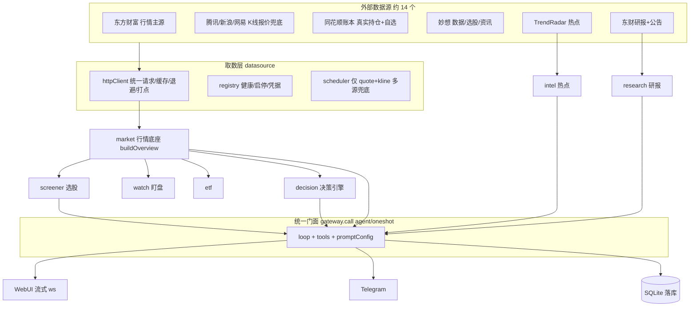
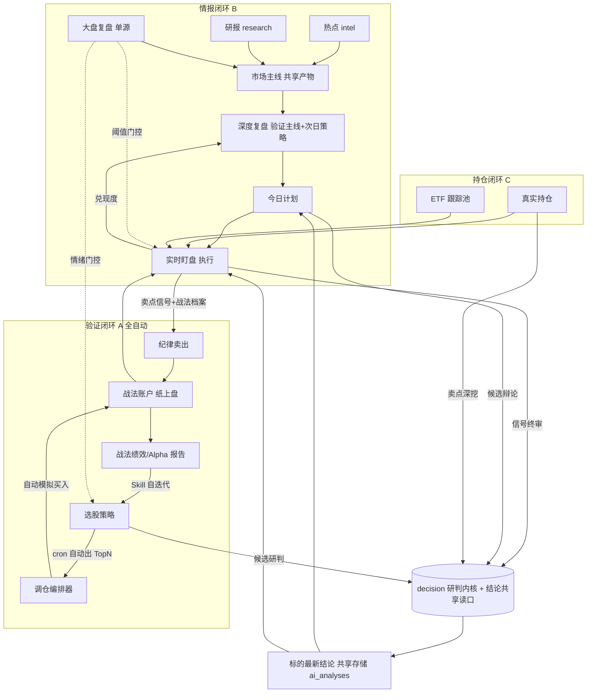

# stock-agent 系统动线与模块结合蓝图

> 本文目标：把项目从「18 个能力孤岛」收敛成贯穿投资生命周期的连续数据闭环。
> 核心不是页面跳转，而是改各模块内部逻辑，让数据与决策在模块间自动流动。
> 状态：规划蓝图，未落代码。供研究与讨论用。

---

## 0. 一句话现状

系统已具备完整的「看盘 → 选股 → 决策 → 计划 → 盯盘 → 复盘 → 战法验证」全套能力，但各模块基本是**独立孤岛**：能力都在，数据不串。已经打通的只有两个枢纽和少数几条链路，大量本可自动闭环的环节仍靠人工在页面间搬运。

两个已存在的枢纽（正交、不重叠）：

- **`plan`（今日计划）= 读中枢**：`backend/src/plan/context.ts` 的 `buildPlanContext` 读取热点 / 研报 / 大盘 / 复盘四源**已落库的最新 AI 分析**（不现场重跑），注入计划生成。
- **`decision`（决策引擎）= 被调用内核**：`backend/src/decision/service.ts` 是全系统**唯一**决策实现，导出 `runDecision / runDecisionBatch`，被盯盘终审、计划候选辩论、持仓卖点弹窗三处复用。

---

## 1. 当前数据流向（as-is）

整体是一条单向链：外部源 → 取数层 → 行情底座 → 业务模块 → 统一 LLM 门面 → 输出。



### 控制流要点

- **统一 LLM 门面**：所有大模型调用经 `backend/src/agent/gateway.ts` 的 `call()`（`agent` 多步带工具 / `oneshot` 单次），统一接管运行记录、调用计量、失败告警、成功推送。严禁业务侧裸调 `getLLM/runAgent/trackedChat`。
- **渐进式工具披露**：`backend/src/agent/loop.ts` + `tools.ts`，初始仅暴露核心常驻工具（`mx_finance_data`、`real_positions`）+ `search_tools` 元工具，模型按需检索加载其余工具。
- **三套调度并存**：
  1. 中央 `scheduled_tasks`（`backend/src/seeds/cronTasks.ts`，妙想战法系列）。
  2. 模块内置 `defineModuleSchedules`（`backend/src/scheduling/`，plan/research/intel/etf/decision/screener/review/market/ops 各自的定时）。
  3. 盯盘 `setTimeout` 常驻轮询（`backend/src/watch/engine.ts`，非 cron）。
- **交易日判定**：收口在 `backend/src/market/calendar.ts`（基于 chinese-days，含调休）。

---

## 2. 现状缺口与数据流隐患（研究重点）

### 2.1 模块结合缺口（核心痛点）

| 缺口 | 现状 | 影响 |
|---|---|---|
| 选股 → 战法 断链 | `screener` 产出 TopN 后不会自动进任何战法账户 | 无法自动验证「某选股策略到底赚不赚钱」 |
| 情报 → 复盘 → 计划 弱耦合 | 各模块各读各的最新分析，无共享「市场主线」产物 | 口径分散，复盘不验证主线，计划无兑现度反馈 |
| decision 重复研判 | 各模块各自调 decision，无「标的最新结论」共享读口 | 重复烧 token，结论不一致 |
| ETF 旁路 | ETF 在盯盘走单 agent 旁路，不走 decision 终审 | 与个股口径不统一 |
| 无账户级总风控 | watch 按信号、战法按账户，无跨账户总闸 | 一旦自动下单，无回撤熔断/连亏停手，风险高 |

### 2.2 数据流隐患（需先治理）

- **分层倒置**：`backend/src/datasource/registry.ts` 为做健康探测反向 import `market/*`、`miaoxiang`、`research/client` 等业务客户端，底层依赖上层，新增源易踩循环依赖。
- **统一取数层名实不符**：scheduler 只调度 `quote/kline`；资金流 / 排名 / clist 快照 / datacenter 等大量东财取数仍散落在 `backend/src/market/eastmoney.ts`、`backend/src/screener/index.ts`，旁路统一层。
- **复盘重复分析**：`market.review`（15:05 文本）与 `review.eod`（15:35 结构化 JSON）都基于 `buildOverview`、都在收盘半小时内、都被 plan 当独立基准读取，同一盘面两次 LLM 复盘。
- **定时双跑脆弱**：中央任务与模块定时多组同时刻（如 14:45 三任务），靠 `backend/src/seeds/cronTasks.ts` 的**逐字 prompt 比对**停用旧任务来规避双跑；用户改过旧 prompt 即失效，会重复研判 / 重复推送。
- **配置散落**：`tool_overrides` / `prompt_overrides` / `sched_<module>` / 市场模块显隐 / 决策 agent override 各占一个 settings JSON key，无集中索引；渐进式披露指令文本硬编码在 `loop.ts`，与「提示词单一来源」理念不一致。
- **交易日判定三处并存**：确定性 cron gate、盯盘引擎、prompt 内软约束，口径可能不一致。

---

## 3. 目标架构：三条自动闭环 + 一个研判内核



### 闭环 A · 选股 → 战法 → 盯盘（全自动验证，最高优先级）

科学验证「某选股策略到底赚不赚钱」，全程免人工。

- **已通的半环**：盯盘 `backend/src/watch/engine.ts` 的 `collectPool` 已自动监控 `kind=local` 战法持仓 + 卖点档案 `profile`。
- **要补的半环**：选股 → 战法自动建仓。
  - 战法账户扩展绑定配置（`backend/src/db/schema.ts` `strategies` 表或 settings）：`pickScreenerStrategyId`、`pickTopN`、`maxPositions`、`sizing`、`autoPick`、`rebalanceCron`。
  - 新增调仓编排器（战法模块 `defineModuleSchedules`）：定时跑/读选股 TopN → diff 当前 `sim_positions` → 新增 pick 且现金足则 `sim.buy`（A 股规则已强制校验）→ 跌出 pick 交盯盘卖点纪律。
  - 卖出侧复用现成：盯盘按 profile 触发 → `backend/src/watch/dispatcher.ts` 走 decision 终审 → 纪律卖出。
  - 绩效报告：扩展战法快照，按选股策略口径产出累计盈亏 / 胜率 / 相对沪深 300 Alpha（复用 decision reflection 的 Alpha 算法）。
  - 打法自迭代：`skillEnabled` 战法经 `propose_skill_update` 迭代选股 / 买入 / 卖出三维打法（`backend/src/strategy/skill.ts` 已支持三维度）。

**成环**：选股策略 → 自动建仓 → 盯盘+纪律卖出 → 绩效报告 → 打法迭代 → 反哺选股。

### 闭环 B · 消息 → 复盘 → 计划

- **抽「市场主线」共享产物**：热点 `backend/src/trendradar/index.ts` + 研报 `backend/src/research/index.ts` 提炼成当日结构化「主线 themes」落库，供 review / plan / decision 共同消费。
- **复盘消费主线**：`backend/src/review/index.ts` 的 `review.eod` 在结构化复盘里**验证主线强弱**并产出次日策略。
- **计划兑现度回流**：次日 review 用今日计划项的触发兑现度（plan 已有 events/状态）算「计划命中率」，反馈下一轮选主线 / 调权重。

**成环**：情报采集 → 主线提炼 → 复盘验证 → 计划落地 → 盯盘执行 → 兑现度反馈。

### 闭环 C · 持仓（真实/ETF）→ 盯盘 → 决策

大部分已通，补 ETF 并轨：让 ETF 持仓也走盯盘卖点 → decision 终审路径，与个股口径统一；真实持仓作为特殊「账户」纳入同一绩效 / 盯盘口径，与战法模拟盘对照。

### 研判内核 · decision 结论共享

建「标的最新研判结论」共享读口（复用 `ai_analyses`，按 code 取 latest verdict）。screener 候选 / plan / watch / positions 写入&读取同一结论，消除重复研判浪费。

### 全局门控

`backend/src/market/overview.ts` 的情绪温度 / 涨跌家数作为 screener 选股数量与 watch 告警阈值的门控（risk-off 日收紧），让大盘从孤立看板变成全局风控开关。

---

## 4. 跨切面增量（横跨三闭环，真正帮到使用者）

三闭环解决「机器内部自动跑通」。以下四个横切能力，补的是「系统如何主动帮到我」。

### D. 账户级统一风控（总闸 · 闭环 A 安全前提）

现状只有 per-signal（watch）和 per-account（战法）风控，无跨账户总闸。闭环 A 自动下单前必须有：

- 跨「真实持仓 + 全部战法」的总仓位上限、单日最大回撤熔断、连续亏损 N 笔自动降频 / 停手。
- 触发熔断时自动暂停 `autoPick` + Telegram 告警。
- 落点：账户级风控配置 + 编排器/盯盘下单前统一过总闸。

### E. 统一交易记忆 + 白话归因（学习层 · 最贴合无量化画像）

- **统一交易记忆库**：所有研判 / 信号 / 计划 / 成交按 code 时间线聚合，新研判自动注入该标的历史教训（把 decision 已做的单点能力推广到全局）。
- **白话归因卡片**：每笔卖出 / 每日复盘后，用 gateway 产出「这笔为什么赚/亏 + 学到什么」的大白话总结（不用因子/IC 术语），沉淀个人交易认知库。
- 价值：系统越用越懂你，把量化黑箱变成可学习的复盘教练。

### F. 智能分级主动推送（人机协同层）

- **晨间一份简报**：热点 / 研报 / 计划 / 隔夜外盘聚合成一条盘前简报，而非多条散推。
- **盘中分级打扰**：只有命中持仓 / 计划 / 高优信号才推，噪声静默（盯盘已有 severity 分级）。
- **尾盘时段守护**：14:45 起针对尾盘套利手法做专门时段提醒。

### G. 个人手法沉淀为系统一等公民（个性化层）

- screener 内置「尾盘动能套利」策略（规则化筛选，无需量化知识维护）。
- 配套专属盯盘档（14:45 触发档）+ 战法卖点档案 profile。
- 直接喂闭环 A 自动验证这套打法长期赚不赚钱。
- 延伸：与 OpenViking 互通——沉淀的偏好 / 止损纪律写回记忆，agent 研判时反向读取注入。

---

## 5. UI 交互引导层（降低心智负担）

逻辑闭环解决「数据怎么流」，UI 引导解决「人怎么用得不累」。核心理念：**从「功能罗列」转向「任务驱动」**——用户不该需要记住 18 个模块各自干嘛，系统应主动告诉他「现在该看什么、该做什么」。

### U1. 首页升级为「作战驾驶舱」(Cockpit)

现首页 `frontend/src/views/MarketView.vue` 是大盘看板。在其之上做一个任务驱动的聚合首页（按交易时段切换重点）：

- **盘前**：今日计划 N 条、晨间简报、风险提示、自动建仓预告。
- **盘中**：盯盘告警、持仓异动、待确认动作。
- **盘后**：复盘摘要、战法绩效变化、归因卡片。

一眼看全当天该干的事，不用挨个点 18 个菜单。这是降低心智负担的第一抓手。

### U2. 标的全生命周期时间线（贯穿动线的可视化）

扩展全局 `frontend/src/components/KlineDialog.vue`：任意标的弹窗里，除 K 线外新增一条「这只票在我系统里的旅程」时间线——

```
被选股选中 → 决策结论 → 是否进计划 → 盯盘信号 → 持仓 → 卖出归因
```

数据来自闭环 A/B 与 decision 结论共享读口（`ai_analyses` 按 code 取时间线）。一处看全，消除「这票我当时为啥买」的记忆负担。

### U3. 渐进式功能披露（新手不被 18 个菜单淹没）

- 侧边栏分组已落地（行情/研判/交易/复盘/系统，`frontend/src/App.vue`）。再加「基础 / 进阶」模式：默认只显示核心动线（行情·选股·计划·盯盘·复盘），把低频高级模块（数据源·调用记录·运维·决策智能体配置）收进「系统/高级」折叠区。
- 首次使用引导（onboarding tour），按投资生命周期顺序点亮各模块。

### U4. 一键动作 + 跨页上下文延续

逻辑层的 `code` 预填，UI 上体现为：任意标的卡片悬浮即出「决策深挖 / 加自选 / 加计划 / 模拟买入」快捷按钮（统一收进 `StockLink` 或新增 `StockActions` 组件），点击带上下文跳转、目标页自动预填 + 面包屑回溯。消除「复制代码 → 切页 → 粘贴」的重复操作。

### U5. 自动闭环的「看得见 + 可干预」（信任与掌控）

闭环 A 会自动下单，UI 必须让用户安心：

- **看得见**：自动建仓/卖出的事件流实时可见（复用 `frontend/src/components/AgentsPanel.vue` 全局抽屉范式）。
- **可急停**：一个显眼的总开关 / kill switch，风控熔断状态（阶段 D）可视化常驻。
- **可追问**：每个自动决策点开即见「为什么」（白话归因）。

没有这层，自动化反而增加黑箱焦虑。

### U6. 白话化与术语翻译（贴合无量化背景）

所有量化指标旁加 tooltip 白话解释（例：「年线偏离 = 现价比过去一年均价高/低多少」「分位 = 当前价在近两年里处于便宜还是贵的位置」），AI 输出强制大白话。降低「看不懂」的认知负担。

### U7. 状态徽标与主动提醒（减少主动巡检）

侧边栏菜单项加 badge：盯盘有新告警、计划有待确认项、战法有 Skill 提案待审、有归因卡片未读。让用户被动接收而非主动逐页巡检。可复用 `frontend/src/stores/agents.ts` 的全局订阅范式扩展为统一通知 store。

### U8. 长任务不阻塞（消解流式等待焦虑）

决策 / 复盘 / 选股横排等流式分析耗时长。统一进度反馈：预计耗时、当前阶段、可后台运行不阻塞切页（已有 `AgentsPanel` + `RunResultDrawer` 抽屉范式，推广到所有长任务）。

---

## 6. 路线图（分期，确认后逐期实现）

| 阶段 | 内容 | 依赖 |
|---|---|---|
| 阶段 0 前置清理 | 复盘合并、去双跑稳定 key、交易日判定收口 | 无（自动闭环安全前提） |
| 阶段 A 验证闭环 | 战法绑定选股 + 调仓编排器 + 绩效/Alpha 报告 + (可选) Skill 联动 | 阶段 0 |
| 阶段 D 账户总风控 | 跨账户总仓位/回撤熔断/连亏停手 | 与 A 并行/紧随 |
| 阶段 B 情报闭环 | 主线共享产物 + review 消费主线 + 计划兑现度回流 | 阶段 0 |
| 阶段 C 内核统一与门控 | 结论共享读口 + 大盘情绪门控 + ETF/真实持仓并轨 | 阶段 A/B |
| 阶段 E 学习层 | 统一交易记忆 + 白话归因卡片 | 阶段 A/B 有数据后 |
| 阶段 F 主动推送层 | 晨间简报聚合 + 盘中分级 + 尾盘守护 | 独立，可早做 |
| 阶段 G 个性化层 | 尾盘套利策略沉淀 + OpenViking 互通 | 阶段 A |
| 阶段 U UI 引导层 | 驾驶舱首页 + 标的时间线 + 渐进披露 + 一键动作 + 自动闭环可控 + 白话化 + 徽标提醒 | 贯穿全程，随对应逻辑阶段配套交付 |

### 建议优先级

`阶段 0` → `阶段 A + D`（验证闭环及其安全前提）→ `阶段 E`（对无量化使用者价值最大）→ `阶段 B/C` → `阶段 F/G`。
其中 E、F 改动相对小、复用现有 gateway / 推送，能最快带来「系统在帮我」的体感。

**UI 引导层（阶段 U）不单独排期，而是随对应逻辑阶段配套交付**，避免「逻辑通了但用户找不到入口」：

- 配套 A/D：U5 自动闭环可见可急停（自动下单上线即需）。
- 配套 E：U2 标的时间线、U6 白话归因展示。
- 配套 F：U1 驾驶舱首页、U7 状态徽标。
- 独立可先行：U3 渐进披露、U8 长任务不阻塞（纯前端、零后端依赖、即时降负）。

---

## 7. 关键文件索引

- 取数层：`backend/src/datasource/`（registry / httpClient / metrics / scheduler / codes）
- 行情底座：`backend/src/market/`（eastmoney / overview / calendar）
- 选股：`backend/src/screener/`（index / service / snapshot / engines）
- 战法：`backend/src/strategy/`（sim / skill / miaoxiangSync）
- 盯盘：`backend/src/watch/`（engine / dispatcher / rules / gate / reflect / digest）
- 决策内核：`backend/src/decision/`（service / index / sellcheck / agentConfig）
- 计划：`backend/src/plan/`（index / service / context）
- 情报：`backend/src/trendradar/`、研报：`backend/src/research/`、复盘：`backend/src/review/`
- 公共分析框架：`backend/src/analyze/`（按 kind 注册 + ai_analyses 历史表）
- LLM 门面与调度：`backend/src/agent/gateway.ts`、`loop.ts`、`tools.ts`、`scheduling/`、`seeds/cronTasks.ts`
- 前端导航（已按工作流分组）：`frontend/src/App.vue`、`frontend/src/router.ts`
