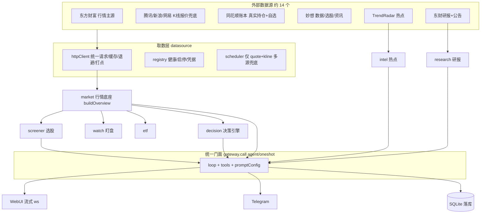
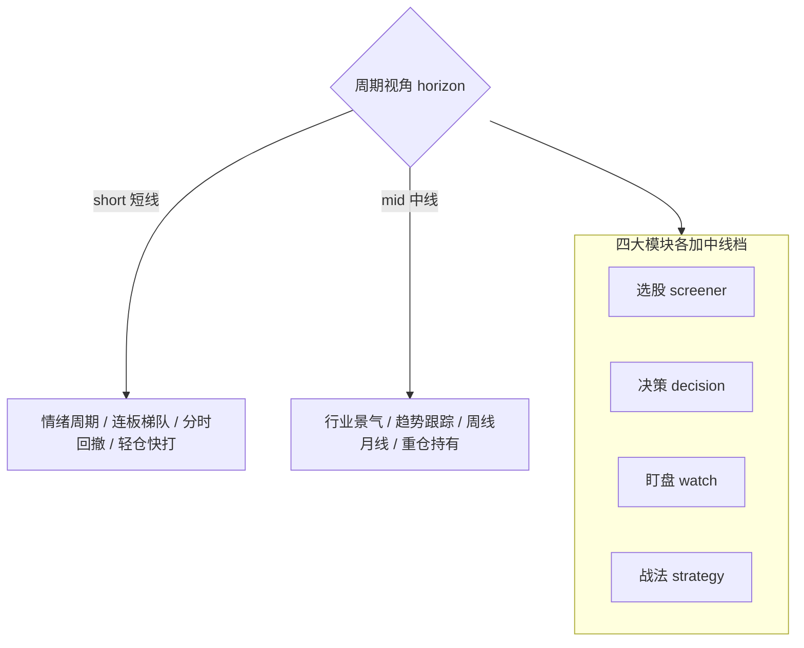
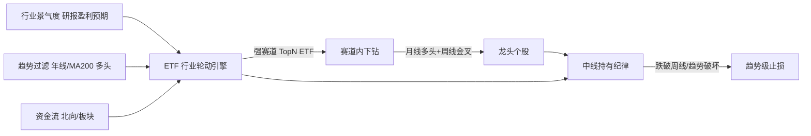
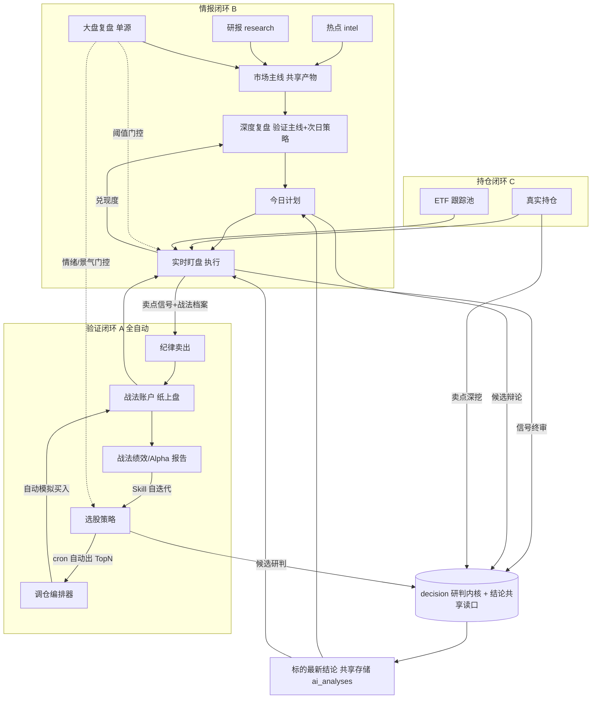

# stock-agent 系统规划总纲

> 融合两条主线：**系统动线与模块结合**（模块怎么连、数据怎么流）+ **交易技术能力补强**（交易能力补什么）。
> 贯穿一条顶层维度：**短线 / 中线双模式**——短线赚情绪的钱（轻仓快打），中线赚趋势与产业景气的钱（重仓持有主升浪，如 2026 年 4 月起的通信 / 半导体 ETF 行情）。
> 核心不是页面跳转，而是改各模块内部逻辑，让数据与决策在模块间自动流动。
> 状态：规划蓝图，未落代码。供研究与讨论用。

---

## 0. 一句话现状

系统已具备完整的「看盘 → 选股 → 决策 → 计划 → 盯盘 → 复盘 → 战法验证」全套能力，但各模块基本是**独立孤岛**：能力都在，数据不串；行情数据足、AI 研判强，但 **A 股交易的核心技术体系（情绪/景气周期、趋势跟踪、龙头梯队、筹码、龙虎榜、仓位/止损/回测）大量缺失**。

两个已存在的枢纽（正交、不重叠）：

- **`plan`（今日计划）= 读中枢**：`backend/src/plan/context.ts` 的 `buildPlanContext` 读取热点 / 研报 / 大盘 / 复盘四源**已落库的最新 AI 分析**（不现场重跑），注入计划生成。
- **`decision`（决策引擎）= 被调用内核**：`backend/src/decision/service.ts` 是全系统**唯一**决策实现，导出 `runDecision / runDecisionBatch`，被盯盘终审、计划候选辩论、持仓卖点弹窗三处复用。

---

## 1. 现状盘点

### 1.1 模块能力家底

行情数据（`market/`）、多因子选股（`screener/`）、多智能体决策（`decision/`）、实时盯盘（`watch/`）、战法纸上盘（`strategy/`）、ETF 指标（`etf/`）、复盘（`review/`）、情报（`trendradar/`、`research/`）、计划（`plan/`）、公共 AI 分析框架（`analyze/`）、统一 LLM 门面与调度（`agent/`、`scheduling/`）。

### 1.2 交易技术家底

| 维度 | 已有能力 | 位置 |
|---|---|---|
| 行情 | 实时报价、多周期 K 线、分时、板块资金流、涨停梯队、情绪温度、期货外盘 | `market/` |
| 选股 | 多因子三层漏斗（题材动量 / 放量突破 / 均衡阿尔法 / 双低价值） | `screener/` |
| 盯盘技术指标 | ATR(14) 波动率归一化、量比、换手率、drawdown/surge 规则 | `watch/` |
| 决策 | 7 分析师辩论（技术 / 游资 / 政策 / 舆情 / 解禁等）+ 多空 + 风控 | `decision/` |
| 战法验证 | 纸上交易账户、A 股规则校验、Alpha 反思记忆 | `strategy/`、`decision/` reflection |
| ETF | 估值分位、折溢价、年线偏离、双动量、网格水位 | `etf/` |
| 复盘 | 大盘复盘、深度复盘、强势板块 / 个股 | `review/` |

**家底特征**：偏「行情 + AI 研判」，缺「A 股交易专业体系」与「守住钱 + 验证策略」的工程纪律——详见第 8 章交易能力短板。

---

## 2. 当前数据流向（as-is）

整体是一条单向链：外部源 → 取数层 → 行情底座 → 业务模块 → 统一 LLM 门面 → 输出。

### 控制流要点

- **统一 LLM 门面**：所有大模型调用经 `backend/src/agent/gateway.ts` 的 `call()`（`agent` 多步带工具 / `oneshot` 单次），统一接管运行记录、调用计量、失败告警、成功推送。严禁业务侧裸调 `getLLM/runAgent/trackedChat`。
- **渐进式工具披露**：`backend/src/agent/loop.ts` + `tools.ts`，初始仅暴露核心常驻工具（`mx_finance_data`、`real_positions`）+ `search_tools` 元工具，模型按需检索加载其余工具。
- **三套调度并存**：① 中央 `scheduled_tasks`（`backend/src/seeds/cronTasks.ts`）② 模块内置 `defineModuleSchedules`（`backend/src/scheduling/`）③ 盯盘 `setTimeout` 常驻轮询（`backend/src/watch/engine.ts`）。
- **交易日判定**：收口在 `backend/src/market/calendar.ts`（基于 chinese-days，含调休）。

---

## 3. 现状缺口与隐患

### 3.1 模块结合缺口

| 缺口 | 现状 | 影响 |
|---|---|---|
| 选股 → 战法 断链 | `screener` 产出 TopN 后不会自动进任何战法账户 | 无法自动验证「某选股策略到底赚不赚钱」 |
| 情报 → 复盘 → 计划 弱耦合 | 各模块各读各的最新分析，无共享「市场主线」产物 | 口径分散，复盘不验证主线，计划无兑现度反馈 |
| decision 重复研判 | 各模块各自调 decision，无「标的最新结论」共享读口 | 重复烧 token，结论不一致 |
| ETF 旁路 | ETF 在盯盘走单 agent 旁路，不走 decision 终审 | 与个股口径不统一 |
| 无账户级总风控 | watch 按信号、战法按账户，无跨账户总闸 | 一旦自动下单，无回撤熔断/连亏停手，风险高 |

### 3.2 数据流隐患（需先治理）

- **分层倒置**：`backend/src/datasource/registry.ts` 为做健康探测反向 import `market/*`、`miaoxiang`、`research/client` 等业务客户端，底层依赖上层，新增源易踩循环依赖。
- **统一取数层名实不符**：scheduler 只调度 `quote/kline`；资金流 / 排名 / clist 快照 / datacenter 等大量东财取数仍散落在 `backend/src/market/eastmoney.ts`、`backend/src/screener/index.ts`，旁路统一层。
- **复盘重复分析**：`market.review`（15:05 文本）与 `review.eod`（15:35 结构化 JSON）都基于 `buildOverview`、都被 plan 当独立基准读取，同一盘面两次 LLM 复盘。
- **定时双跑脆弱**：中央任务与模块定时多组同时刻，靠 `backend/src/seeds/cronTasks.ts` 的**逐字 prompt 比对**停用旧任务来规避双跑；用户改过旧 prompt 即失效，会重复研判 / 重复推送。
- **配置散落**：`tool_overrides` / `prompt_overrides` / `sched_<module>` / 市场模块显隐 / 决策 agent override 各占一个 settings JSON key，无集中索引。
- **交易日判定三处并存**：确定性 cron gate、盯盘引擎、prompt 内软约束，口径可能不一致。

### 3.3 交易能力短板速览

详见第 8 章。一句话总览：A 股短线博弈核心（情绪周期 / 龙头梯队 / 题材阶段 / 筹码 / 龙虎榜）与中线趋势核心（行业景气轮动 / 月线周线趋势）几乎空白，且仓位 / 止损 / 回测 / 绩效这套工程纪律缺失。

---

## 4. 顶层维度：短线 / 中线双模式（horizon）

引入 `horizon = 'short' | 'mid'` 周期视角，**贯穿选股 / 决策 / 盯盘 / 战法四大模块**。不是新增模块，而是给现有模块装上「周期挡位」——同一套链路，两套参数与逻辑。三条闭环（A/B/C）在两种 horizon 下各跑一遍。

### 中线方法论内核

行业景气轮动 + 趋势跟踪（月线定方向 / 周线找买点）+ 右侧入场 + 核心卫星配置 + 趋势级风控。落地为「**ETF 锁定强赛道 → 赛道内下钻选龙头个股**」的发现链路：

### 四模块的中线挡位

- **M1 ETF 行业轮动引擎（赛道层，中线发现起点）**：复用 `backend/src/etf/` 现成指标（双动量 R20/R60/R120、年线偏离、估值分位），新增行业景气度（`research` 盈利预期）+ 趋势过滤（站上年线/MA200）+ 资金流多维打分，输出强赛道 TopN ETF，双周/月度调仓（偏差超 8% 才换）。
- **M2 中线选股档（赛道→个股下钻）**：`backend/src/screener/` `engines.ts` 新增中线策略——月线多头排列、周线缩量回踩/金叉、放量突破平台、右侧确认；选股可限定在 M1 强赛道 ETF 成分股内选龙头。
- **M3 中线决策档**：`backend/src/decision/` 按 horizon 调分析师权重，中线重景气/趋势/基本面、弱化游资情绪，核心问题从「今天买不买」变为「主升浪是否还在、该不该减」。
- **M4 中线盯盘档**：`backend/src/watch/` 中线只在跌破周线/月线、趋势破坏时告警，过滤日内噪声（贴合「拿得住」）。
- **M5 中线战法档**：`backend/src/strategy/` profile 增加中线纪律——趋势不破不走、跌破 10 周线离场、核心卫星仓位、金字塔加减仓。

---

## 5. 目标架构：三条自动闭环 + 一个研判内核

> 三闭环在短线/中线两种 horizon 下各自成立：闭环 A 的「选股策略」「战法档案」「盯盘卖点」均分短线档与中线档；闭环 B 的「市场主线」天然偏中线赛道；闭环 C 的 ETF 正是中线主力载体。

### 闭环 A · 选股 → 战法 → 盯盘（全自动验证，最高优先级）

科学验证「某选股策略到底赚不赚钱」，全程免人工。

- **已通的半环**：盯盘 `backend/src/watch/engine.ts` 的 `collectPool` 已自动监控 `kind=local` 战法持仓 + 卖点档案 `profile`。
- **要补的半环**：选股 → 战法自动建仓。
  - 战法账户扩展绑定配置（`backend/src/db/schema.ts` `strategies` 表或 settings）：`pickScreenerStrategyId`、`pickTopN`、`maxPositions`、`sizing`、`autoPick`、`rebalanceCron`、`horizon`。
  - 新增调仓编排器（战法模块 `defineModuleSchedules`）：定时跑/读选股 TopN → diff 当前 `sim_positions` → 新增 pick 且现金足则 `sim.buy`（A 股规则已强制校验）→ 跌出 pick 交盯盘卖点纪律。
  - 卖出侧复用现成：盯盘按 profile 触发 → `backend/src/watch/dispatcher.ts` 走 decision 终审 → 纪律卖出。
  - 绩效报告：扩展战法快照，按选股策略口径产出累计盈亏 / 胜率 / 相对沪深 300 Alpha（复用 decision reflection 的 Alpha 算法）。
  - 打法自迭代：`skillEnabled` 战法经 `propose_skill_update` 迭代选股 / 买入 / 卖出三维打法（`backend/src/strategy/skill.ts` 已支持三维度）。

**成环（短线档）**：选股策略 → 自动建仓 → 盯盘+纪律卖出 → 绩效报告 → 打法迭代 → 反哺选股。

**成环（中线档）**：ETF 行业轮动选强赛道 → 赛道内月线/周线选龙头 → 中线战法建仓（核心卫星仓位）→ 趋势级盯盘（跌破周线才动）→ 中线绩效/Alpha 报告 → 反哺赛道与个股打法。两档共用同一套编排器与绩效口径，仅 horizon 参数不同。

### 闭环 B · 消息 → 复盘 → 计划

- **抽「市场主线」共享产物**：热点 `backend/src/trendradar/index.ts` + 研报 `backend/src/research/index.ts` 提炼成当日结构化「主线 themes」落库，供 review / plan / decision 共同消费。主线天然附带中线赛道与景气阶段标签（对接第 8 章 S5）。
- **复盘消费主线**：`backend/src/review/index.ts` 的 `review.eod` 在结构化复盘里**验证主线强弱**并产出次日策略。
- **计划兑现度回流**：次日 review 用今日计划项的触发兑现度（plan 已有 events/状态）算「计划命中率」，反馈下一轮选主线 / 调权重。

### 闭环 C · 持仓（真实/ETF）→ 盯盘 → 决策

大部分已通，补 ETF 并轨：让 ETF 持仓也走盯盘卖点 → decision 终审路径，与个股口径统一；真实持仓作为特殊「账户」纳入同一绩效 / 盯盘口径，与战法模拟盘对照。ETF 同时是中线主力载体。

### 研判内核 · decision 结论共享

建「标的最新研判结论」共享读口（复用 `ai_analyses`，按 code 取 latest verdict）。screener 候选 / plan / watch / positions 写入&读取同一结论，消除重复研判浪费。

### 全局门控（双周期）

`backend/src/market/overview.ts` 作为全局风控开关，按 horizon 分两套门控：

- **短线门控**：情绪温度 / 涨跌家数 / 连板高度作为 screener 选股数量与 watch 告警阈值的门控（情绪退潮/冰点收紧，高潮减仓）。对接 S1。
- **中线门控**：行业景气周期 + 宏观状态（美林时钟）作为赛道轮动与中线建仓的门控（景气向上才进攻，景气退坡转防御/红利）。

---

## 6. 跨切面增量（横跨三闭环，真正帮到使用者）

### D. 账户级统一风控（总闸 · 闭环 A 安全前提）

现状只有 per-signal（watch）和 per-account（战法）风控，无跨账户总闸。闭环 A 自动下单前必须有：跨「真实持仓 + 全部战法」的总仓位上限、单日最大回撤熔断、连续亏损 N 笔自动降频 / 停手；触发熔断自动暂停 `autoPick` + Telegram 告警。对接 S2/S12。

### E. 统一交易记忆 + 白话归因（学习层 · 最贴合无量化画像）

- **统一交易记忆库**：所有研判 / 信号 / 计划 / 成交按 code 时间线聚合，新研判自动注入该标的历史教训。
- **白话归因卡片**：每笔卖出 / 每日复盘后，用 gateway 产出「这笔为什么赚/亏 + 学到什么」的大白话总结（不用因子/IC 术语），沉淀个人交易认知库。对接 S10。

### F. 智能分级主动推送（人机协同层）

- **晨间一份简报**：热点 / 研报 / 计划 / 隔夜外盘聚合成一条盘前简报。
- **盘中分级打扰**：只有命中持仓 / 计划 / 高优信号才推（盯盘已有 severity 分级）。
- **尾盘时段守护**：14:45 起针对尾盘套利手法做专门时段提醒。

### G. 个人手法沉淀为系统一等公民（个性化层）

- screener 内置「尾盘动能套利」策略（规则化，无需量化知识维护），配套专属盯盘档 + 战法档案，喂闭环 A 自动验证。对接 S6。
- 延伸：与 OpenViking 互通——沉淀的偏好 / 止损纪律写回记忆，agent 研判时反向读取注入。

---

## 7. UI 交互引导层（降低心智负担）

核心理念：**从「功能罗列」转向「任务驱动」**——系统主动告诉用户「现在该看什么、该做什么」。

- **U1 作战驾驶舱首页**：在 `frontend/src/views/MarketView.vue` 之上做任务驱动聚合首页，盘前/盘中/盘后切换重点（计划、告警、复盘、绩效），不用挨个点菜单。
- **U2 标的全生命周期时间线**：扩展 `frontend/src/components/KlineDialog.vue`，展示「被选股选中 → 决策结论 → 进计划 → 盯盘信号 → 持仓 → 卖出归因」，数据来自结论共享读口。
- **U3 渐进式功能披露**：侧边栏分组（行情/研判/交易/复盘/系统）已落地，再加「基础/进阶」模式 + 首次引导。
- **U4 一键动作 + 上下文延续**：标的悬浮即出「决策深挖/加自选/加计划/模拟买入」，带上下文跳转 + 面包屑。
- **U5 自动闭环看得见+可急停+可追问**：自动建仓/卖出事件流（复用 `AgentsPanel`）+ kill switch + 每个决策可点开看「为什么」。
- **U6 白话化与术语翻译**：量化指标旁加 tooltip 白话解释，AI 输出强制大白话。
- **U7 状态徽标与主动提醒**：侧边栏 badge（告警/待确认/Skill 提案/未读归因），复用 `agents` store 范式。
- **U8 长任务不阻塞**：流式分析可后台运行不阻塞切页（复用 `RunResultDrawer`）。
- **U9 周期视角切换**：选股/决策/盯盘/战法页顶部统一「短线 ⇄ 中线」挡位开关，切换后策略/指标/阈值/纪律随之切换，挡位全局记忆。

---

## 8. 交易技术能力补强（S1-S12）

> 视角：交易/投资专业能力。约束：优先**规则化 + AI 化、不需量化知识维护**。每项标注与架构的映射。

### P0 命脉级

- **S1 市场情绪周期量化**（短线择时总开关）：连板高度/炸板率/晋级率/涨停溢价 → 0-100 情绪指数 → 冰点/恢复/高潮/退潮。决定敢不敢做、做多大仓。→ 落地为第 5 章「短线门控」内核。数据东财可取，**不需量化知识**。
- **S2 仓位与资金管理**：波动率仓位（仓位 ∝ 1/ATR）、固定比例风险（单笔亏损≤2%）、金字塔加减仓、单票/总仓上限。→ 并入跨切面 D 账户总风控。**不需量化知识**。
- **S3 止损止盈纪律引擎**：硬止损 / 移动止盈 / ATR 止损 / 跌破均线止损，结构化进战法 profile，盯盘强制触发。→ 闭环 A 卖出侧（短线分时、中线跌破周线）。**不需量化知识**。

### P1 重要

- **S4 历史回测引擎**：拿策略跑历史数据，秒级得出胜率/最大回撤/夏普（含手续费/滑点）。→ 加速闭环 A 策略验证。部分需量化知识，借成熟库。
- **S5 题材/板块生命周期识别**：启动/发酵/高潮/退潮/冰点阶段标签。→ 闭环 B 主线共享产物增强 + 中线赛道阶段。**不需量化知识**。
- **S6 龙头/连板梯队识别**：总龙头/中军/弹性标的、首板/连板高度、龙头辨识（先涨停/先放量/先拉升/量比 2.0+）。→ screener 短线策略 + 盯盘信号源，对接 G。**不需量化知识**。
- **S7 龙虎榜/游资/资金面**：龙虎榜、游资席位、北向、两融、大宗。→ decision 游资分析师从「AI 猜」升级为「数据+AI」，同时是中线门控资金维度。**不需量化知识**。

### P2 增强

- **S8 筹码分布 / 主力成本**：筹码峰判断建仓/洗盘/出货。→ KlineDialog 增强 tab + 决策输入。
- **S9 技术指标库扩充**：MACD/KDJ/RSI/BOLL（项目已用 `trading-signals`）。→ 盯盘/决策可选输入。
- **S10 完整绩效归因**：夏普/索提诺/卡玛/最大回撤/VaR/胜率/盈亏比，白话化展示。→ 统一战法/真实持仓/回测口径，对接 E。
- **S11 个股风险预警扫描**：商誉减值/业绩暴雷/质押爆仓/ST/解禁洪峰，定时扫描 + Telegram 预警。
- **S12 组合层风险**：持仓相关性/行业集中度/Beta 暴露。→ 阶段 D 延伸。

> 关键判断：S1/S2/S3/S5/S6/S7 六项**都不需量化知识**，全可用「规则 + AI 解读 + 现成东财数据」实现。数据层（连板/龙虎榜/筹码/财务）东财基本都能取，瓶颈在于把专业交易逻辑结构化进系统。

---

## 9. 统一路线图

两条主线并行，共用基建。中线线可按你的真实需求前置。

| 阶段 | 内容 | 依赖 / 对接短板 |
|---|---|---|
| 阶段 0 前置清理 | 复盘合并、去双跑稳定 key、交易日判定收口 | 自动闭环安全前提 |
| 阶段 A 验证闭环 | 战法绑定选股 + 调仓编排器 + 绩效/Alpha 报告 + Skill 联动 | 阶段 0；含 S3 |
| 阶段 D 账户总风控 | 跨账户总仓位/回撤熔断/连亏停手 | 与 A 并行；S2/S12 |
| 阶段 B 情报闭环 | 主线共享产物 + review 消费主线 + 兑现度回流 | 阶段 0；S5 |
| 阶段 C 内核统一与门控 | 结论共享读口 + 双周期门控 + ETF/持仓并轨 | 阶段 A/B；S1/S7 |
| 阶段 E 学习层 | 统一交易记忆 + 白话归因卡片 | 有数据后；S10 |
| 阶段 F 主动推送层 | 晨间简报聚合 + 盘中分级 + 尾盘守护 | 独立可早做 |
| 阶段 G 个性化层 | 尾盘动能套利沉淀 + OpenViking 互通 | 阶段 A；S6 |
| 阶段 M0 双模式基建 | `horizon` 贯穿 DTO 与四模块 + 周期切换 UI | 与阶段 0 一同打底 |
| 阶段 M1 ETF 行业轮动 | 赛道层景气+趋势+资金流打分、双周/月度调仓 | 阶段 M0；S5/S7 |
| 阶段 M2 中线选股+下钻 | 月线/周线趋势因子 + 赛道内选龙头 | 阶段 M1 |
| 阶段 M3 中线决策/盯盘/战法档 | 四模块中线参数与逻辑 | 阶段 M0 |
| 阶段 M4 中线验证闭环 | 闭环 A 中线版 + 中线绩效报告 | 阶段 A、M1-M3 |
| 技术增强 S4/S8/S9/S11 | 回测引擎、筹码、指标库、风险预警 | 按需补，部分后置 |
| 阶段 U UI 引导层 | 驾驶舱 + 时间线 + 渐进披露 + 一键动作 + 闭环可控 + 白话化 + 徽标 + 周期切换 | 随对应逻辑阶段配套交付 |

### 建议优先级

- **短线/闭环线**：`阶段 0` → `阶段 A + D`（验证闭环及安全前提）→ `阶段 E` → `阶段 B/C` → `阶段 F/G`。
- **中线线**（按你更看重中线，可前置）：`阶段 M0`（与阶段 0 一起打底）→ `阶段 M1`（ETF 行业轮动，复用现成指标、最快见效）→ `阶段 M2`（赛道下钻选龙头）→ `阶段 M3/M4`。
- **交易能力**：S1（情绪门控）、S2/S3（仓位止损）随阶段 C/D 一并落；S5/S6/S7 随中线线与个性化落；S4/S8/S9/S11/S12 后置增强。
- **UI 引导层**：随对应逻辑阶段配套交付（U3/U8 纯前端可先行）。

---

## 10. 关键文件索引 + 数据可行性

### 文件索引

- 取数层：`backend/src/datasource/`（registry / httpClient / metrics / scheduler / codes）
- 行情底座：`backend/src/market/`（eastmoney / overview / calendar）
- 选股：`backend/src/screener/`（index / service / snapshot / engines）
- 战法：`backend/src/strategy/`（sim / skill / miaoxiangSync）
- 盯盘：`backend/src/watch/`（engine / dispatcher / rules / gate / reflect / digest）
- 决策内核：`backend/src/decision/`（service / index / sellcheck / agentConfig）
- 计划：`backend/src/plan/`（index / service / context）
- 情报/研报/复盘：`backend/src/trendradar/`、`backend/src/research/`、`backend/src/review/`
- ETF：`backend/src/etf/`（中线赛道层主力）
- 公共分析框架：`backend/src/analyze/`（按 kind 注册 + ai_analyses 历史表）
- LLM 门面与调度：`backend/src/agent/gateway.ts`、`loop.ts`、`tools.ts`、`scheduling/`、`seeds/cronTasks.ts`
- 前端：`frontend/src/App.vue`（导航分组）、`frontend/src/views/`、`frontend/src/components/`、`frontend/src/stores/`

### 数据可行性

中线与交易能力所需数据，东财 / 现有数据源基本都能取，无需新增付费源：

- 连板/涨停/炸板/晋级（S1、S6）：东财涨停板行情
- 龙虎榜/北向/两融/大宗（S7、中线资金门控）：东财 datacenter
- 筹码分布（S8）：东财筹码接口
- 历史 K 线（S4 回测、月线/周线趋势）：已有多源 K 线能力
- 行业景气/盈利预期（M1、S5）：research 研报 + 妙想 datacenter
- 财务/解禁/质押（S11）：东财 + 妙想

数据不是瓶颈，瓶颈在于把专业交易逻辑结构化进系统——这正是本总纲的落地重点。

---

## 11. 评审与修正建议（Codex review · gpt-5.5，2026-06-13）

> 以「资深交易系统架构师 + A 股实战交易员」双视角对本总纲的批判性评审。结论先行，再列修正项。**本节为待消化的修正建议，主体规划暂保留原样**，落地前应据此调整优先级与边界。

**一句话结论**：方向对，但**执行顺序偏危险、范围明显过大**。最大问题不是「缺模块」，而是过早追求自动闭环、AI 研判一致性、全市场解释力。对个人系统而言，**先证明一个中线策略能稳定避坑，比把所有模块连起来更重要**。

### 11.1 架构 / 顺序问题（最关键）

- **闭环 A「全自动模拟买入」不能排在账户级总风控之前，也不该与其并行**。即使是模拟盘，也会污染绩效样本、制造错误反馈、强化坏策略。正确顺序：
  1. 数据可信度检查 → 2. 策略规则固化 → 3. 仓位/止损/熔断 → 4. 回测/历史重放 → 5. 小规模前向模拟 → 6. 才轮到自动调仓。
- 文档「闭环 A 最高优先级」**定错了**。真正的第一优先级是**下单前置约束层**：可买池、最大仓位、单票/行业上限、止损线、暂停条件、数据异常拒绝交易。
- **`decision` 研判内核有过度设计倾向**：7 分析师辩论 + 结论共享 + AI 归因 + Skill 自迭代，容易变成「解释系统」而非「交易系统」。中线主升浪只需少量硬规则：趋势是否成立、赛道是否强、仓位是否超限、止损是否触发。
- **`horizon = short | mid` 抽象正确，但双模式同时落地太早**，会过早扩大改造面。两者信号/持仓周期/止损/绩效口径完全不同。**建议先只做 `mid`**，不要同时维护双模式。

### 11.2 交易逻辑硬伤

- **ETF 轮动核心坑：把「涨得好」误认为「还能涨」**。R20/R60/R120 动量 + 年线偏离 + 资金流打分都容易追在高潮区。必须加「拥挤度 / 过热 / 回撤后再确认」规则，否则会不断高位换入强势 ETF。
- **「月线定方向、周线找买点」太粗**。难点不是识别多头，而是避免周线买点变成月线末端。须明确三条：不买乖离过大的突破、不买连续加速后的第一次回踩、不在行业景气证伪后用技术形态硬撑。
- **情绪周期量化（S1）适合短线，不适合直接指导中线 ETF**。把连板高度/炸板率/晋级率用于中线赛道会错配。中线更该看：行业指数相对沪深 300 强弱、成分股扩散度、龙头新高比例、成交额趋势、政策/业绩验证。
- **「景气度 + 研报盈利预期」（M1）危险**：研报滞后且在高位最乐观。中线系统不能只读观点，必须读可验证指标：板块指数趋势、成分股财报兑现、盈利预期上修/下修方向、ETF 规模与成交异常。

### 11.3 计划过大 —— 只做 3 件事

整体像团队级投研交易平台，不像个人中线辅助系统。无量化背景的前端开发者最容易死在四件事：数据源维护、指标解释膨胀、AI 输出不稳定、回测/模拟结果自欺。若只做 3 件：

1. **中线 ETF / 行业强弱榜**：只回答「哪些赛道处于主升浪，哪些已过热或破位」——中线主升浪入口，价值最大。
2. **持仓级风控与卖出纪律**：只回答「现在该不该减仓/止损/继续拿」——个人交易最大收益提升来自少犯大错，不是多找标的。
3. **交易日志 + 事后归因**：每笔买卖记录买入理由、失效条件、实际结果——否则永远无法区分「策略有效」和「行情刚好」。

> 自动模拟买入、Skill 自迭代、多智能体辩论、龙虎榜、筹码、尾盘套利，**全部后置**。

### 11.4 被遗漏的致命盲点（本总纲权重不足）

- **数据质量未列为最高优先级**：复权口径不一致、ETF 成分股变更、停牌、涨跌停无法成交、盘中快照缺失、资金流字段口径变化。**没有数据审计，后面所有回测和模拟都不可信**。
- **未来函数（前视偏差）风险严重**：用收盘后才知道的涨停梯队/研报/资金流/行业强弱去生成「当天买点」=不自觉作弊。**每个字段须标注「可用时间」，策略只能使用当时已知数据**。
- **过拟合被低估**：打分项越多越容易调出漂亮历史结果。个人系统应避免复杂综合分，**优先用少数不可随意调参的规则**。
- **模拟盘 ≠ 实盘**：模拟默认成交会高估收益。真实交易有滑点、冲高回落、涨停买不进、跌停卖不出、尾盘流动性不足、ETF 折溢价。**模拟盘必须加入成交约束**，否则绩效无意义。
- **AI 不能作为交易触发器**：AI 可解释/总结/检查遗漏，但**买卖触发必须来自确定性规则**，否则同一行情不同 prompt 输出不同结论，无法复盘。

### 11.5 建议的精简中线 MVP（砍掉约 70%）

MVP 不做「全自动交易闭环」，做「中线主升浪辅助驾驶」：

- **第一阶段 · 中线赛道雷达**：输出约 20 个核心行业/ETF 状态（上升 / 回踩 / 加速 / 过热 / 破位）。规则只用周线/月线、相对强弱、成交额、年线/20 周线、最大回撤。
- **第二阶段 · 持仓风控面板**：每个真实持仓只给三类动作（继续持有 / 减仓观察 / 退出），必须显示触发理由与失效条件（如跌破 10 周线、相对强弱转弱、行业 ETF 破位）。
- **第三阶段 · 买点候选池**：只从强赛道选，买点限定「周线回踩不破 + 重新放量转强」，禁止追连续加速；每个候选必须有计划仓位、止损线、预期持有周期。
- **第四阶段 · 小规模模拟验证**：只验证这套中线规则，不接短线情绪、不接自动自迭代；至少跑满 3~6 个月前向样本，再考虑自动化。

> **最终建议**：把系统从「全能 AI 交易平台」收缩成「**中线趋势识别 + 持仓纪律执行 + 交易复盘机器**」——更符合作者背景，也更接近能真正改善实盘结果的系统。

### 11.6 与现有路线图的对照（差异速查）

- 本总纲优先级：`阶段 A（自动闭环）+ D（风控）并行` → Codex：**风控/前置约束必须在自动闭环之前，闭环 A 降级后置**。
- 本总纲：`M0 双模式基建`同时铺 short+mid → Codex：**先只做 mid，short 暂缓**。
- 本总纲：S1 情绪周期作为全局门控（含中线）→ Codex：**S1 仅用于短线；中线门控改用行业相对强弱/扩散度/成交额趋势**。
- 本总纲未单列：数据审计、字段可用时间、模拟成交约束 → Codex：**应提升为阶段 0 的硬前置项**。

---

## 12. 全系统评审 · 第二轮（Codex review · 基于真实代码，2026-06-13）

> 上一轮（第 11 节）火力集中在 ETF/中线。本轮把视角拉到**整个系统 + 整个总纲**，Codex 实际读取了 `backend/src` 相关代码后逐模块点评。**结论比上轮更落地，含若干代码级硬发现**，建议作为阶段优先级重排的主要依据。

**总结论**：总纲的问题不是「模块不够」，而是**把很多辅助能力包装成闭环，把不稳定的 AI 文本当成系统状态**。应先把系统收紧成「**可审计、可失效、可停止**」的个人交易辅助系统，再谈自动化。

### 12.1 阶段 0 治理项真实严重度排序（代码已验证）

1. **定时双跑靠 prompt 逐字比对停旧任务 = 真坑**：代码里确实靠 `LEGACY_PROMPTS` + 任务名 + 旧文案匹配做迁移，用户改过 prompt 即保护失效，会造成中央任务与模块任务并存 → 重复研判 / 重复推送 / 甚至重复模拟交易。**必须先治**。
2. **复盘双跑 = 中高风险**：`market.review`(15:05 大盘点评) 与 `review.eod`(15:35 深度 JSON) 制造两个「市场结论」，plan 同时读取易口径打架。建议合并为一个结构化复盘，另一个降为摘要视图。
3. **交易日判定三处并存 = 中风险**：模块调度与 watch 已用 `market/calendar.ts`，但中央 prompt 仍有「默认放行」软约束。只要涉及自动/模拟交易，**交易日必须是代码 gate，不能靠模型判断**。
4. **统一取数层名实不符 = 中风险**：`datasource/scheduler.ts` 只管 quote/kline，其他东财接口仍散落，影响数据健康/降级/统计。**边做边治，别为「统一」停业务**。
5. **配置散落 = 低中风险**：单人系统可接受，模块稳定后再做配置索引页。
6. **datasource/registry 反向 import 业务客户端 = 低风险/偏洁癖**：除非出现循环依赖或启动慢，否则后置。

> 治理原则：**先治会导致「重复运行 / 错误交易 / 错误缓存」的问题；分层洁癖与配置美化后置**。

### 12.2 代码级硬发现（落地必踩）

- **`ai_analyses` 不能直接当「结论共享读口」**：该表现只有 `content(markdown) / kind / refKey / createdAt`，无 code / 场景 / 有效期 / 输入快照。直接当缓存会把「买入研判」错用到「卖点检查」、把「昨晚结论」用到「盘中急跌」。**必须新建带以下字段的 verdict 表**：`code / assetType / scenario(buy|sell|hold|watch|plan) / horizon / dataAsOf / expiresAt / inputHash / verdictJson / confidence / invalidators`。失效策略保守：过期、场景不一致、价格偏离输入快照超阈值，一律重跑或降级不用。**缓存只能省 token，不能替代实时风控**。
- **`search_tools` 渐进披露适合聊天，不适合关键定时任务**：模型偶发搜不到工具，结果会漂。**定时任务应显式声明工具白名单**。
- **三套调度不是原罪，但缺统一作业目录 + 互斥**：需要最小治理——全局 job registry（owner / purpose / enabled / lastRun / nextRun）、同 purpose 同时间窗只允许一个主任务、交易/模拟类 job 加 SQLite run lock、节假日 gate 只在代码层。

### 12.3 闭环重新定性

- **闭环 C 不是「交易闭环」，是「纪律提醒闭环」**：只读真实持仓 → 盘中破位/止损/止盈提醒 → 日终持仓归因 → 真实账户与模拟策略对照识别偏差。**ETF 并轨只统一风险视图与提醒口径，不要夸大成自动交易闭环**。
- **闭环 B「市场主线」必须结构化，不能是 AI 自由文本**：落 schema `theme_id / name / evidence / source / time / window / strength / confidence / stage / related_codes / invalidators`，每条主线带证据（涨幅、成交额、资金流、研报数量、新闻时间、代表标的表现），**AI 只做归纳、不做唯一事实源**。
- **「兑现度回流自动调权」= 自我强化过拟合**：样本小、市场状态变、AI 解释会漂移。**只做统计展示**（命中/触发/失效/次日·5日表现），**不自动改权重**，最多给人工复盘提示。

### 12.4 跨切面增量 D/E/F/G 取舍

- **高杠杆**：
  - **D 账户总风控** —— 必做，且**前置到任何自动模拟买卖之前**。
  - **F 分级推送** —— 单人系统最怕噪音，**少推准推 > 多分析**。
  - **E 交易记忆** —— 有价值，但**必须结构化记录买入理由/失效条件/结果**，不只存大白话作文。
- **镀金 / 后置**：白话归因卡片（不能替代结构化复盘）、个人手法产品化（等稳定样本）、OpenViking 互通（记忆先本地闭环稳定）；**Skill 自迭代高风险**，易让坏样本自动改坏策略，**必须人工审批、默认关闭**。

### 12.5 UI 引导层取舍（单人系统）

- **保留**：U1 驾驶舱（做紧凑状态面板，不做花哨首页）、U2 标的时间线（助复盘）、**U5 自动闭环可见 + 急停 kill switch（必留）**、U7 状态徽标（低成本高收益）。
- **可砍 / 后置**：U3 渐进式披露（单人收益低）、U4 一键动作（诱导频繁操作）、U6 术语 tooltip（锦上添花）、U8 长任务后台（已有运行抽屉即可，别重做）、**U9 全局短/中线切换（先别做双模式，放大复杂度）**。

### 12.6 精简后的全局阶段顺序（保留中线为主线）

> 取代第 9 章「统一路线图」的执行顺序建议。核心：**先把系统从「很多 AI 模块会说话」改成「少数关键状态可审计、可失效、可停止」，再扩闭环**。

1. **安全底座**：统一 job registry、去双跑、交易日代码 gate、模拟交易互斥锁、kill switch、数据时间戳（含字段 `dataAsOf`）。
2. **真实持仓纪律闭环**（闭环 C 落地）：只读真实持仓 + 计划触发 + 止损/止盈/破位提醒 + 日终持仓归因。**先服务实盘决策，不下单**。
3. **结构化市场主线**（闭环 B 内核）：热点/研报/复盘提炼 themes，**必须结构化、带证据、带失效条件**，计划只消费结构化结果。
4. **计划与复盘合并**：一个收盘结构化复盘 + 一个盘前计划，取消重复大盘结论，**兑现度只统计不自动调参**。
5. **decision 缓存升级**：用带场景/有效期/输入快照的 verdict 表替代 markdown latest 读口。
6. **中线主线能力**（M 线收敛版）：保留中线为主线，**只接已稳定的数据与持仓纪律，不同时铺短线体系**。
7. **小规模模拟验证**：风控/数据/调度稳定后再做自动模拟买入，**先白名单策略，禁止 Skill 自动改策略**。
8. **体验层收口**：驾驶舱、时间线、分级推送、急停；其他 UI 等系统真正跑起来再补。

### 12.7 两轮评审与本总纲的净差异（决策清单）

- 闭环 A（自动模拟买入）：本总纲列「最高优先级」→ 评审**降到第 7 步**，前置安全底座 + 风控 + 数据 + 调度。
- 双模式 `horizon`（M0）：本总纲「与阶段 0 一起打底铺 short+mid」→ 评审**先只做 mid，U9 切换暂缓**。
- S1 情绪周期：本总纲「全局门控含中线」→ 评审**仅短线用；中线门控改行业相对强弱/扩散度/成交额趋势**。
- `ai_analyses` 结论共享读口：本总纲「复用 ai_analyses 取 latest verdict」→ 评审**另建结构化 verdict 表，否则陈旧/错场景结论会污染风控**。
- 兑现度反哺权重：本总纲「反哺下一轮选主线/调权重」→ 评审**改为只统计 + 人工提示，禁自动调参**。
- Skill 自迭代 / OpenViking 互通：本总纲「闭环 A 打法自迭代 + G 互通」→ 评审**人工审批默认关闭 / 后置**。
- 阶段 0 隐患：本总纲并列六项 → 评审**只「去双跑 + 交易日代码 gate + 复盘合并」需先治，其余边做边治或后置**。
