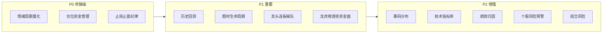

# stock-agent 股票技术能力短板与补强建议

> 视角：**交易/投资专业能力**，不是代码工程。
> 对照对象：A 股短线交易体系（情绪周期 / 龙头梯队 / 题材生命周期 / 筹码 / 龙虎榜）+ 量化交易标配（仓位模型 / 止损纪律 / 回测 / 绩效归因）。
> 约束：贴合使用者无量化背景——优先选**规则化 + AI 化、不需要因子/IC 知识即可维护**的补强方式。
> 状态：发散建议，未落代码。

---

## 0. 现状技术能力盘点（已有什么）

先明确系统当前的「股票技术」家底，避免重复造轮子：

| 维度 | 已有能力 | 位置 |
|---|---|---|
| 行情 | 实时报价、多周期 K 线、分时、板块资金流、涨停梯队、情绪温度、期货外盘 | `market/` |
| 选股 | 多因子三层漏斗（题材动量 / 放量突破 / 均衡阿尔法 / 双低价值） | `screener/` |
| 盯盘技术指标 | ATR(14) 波动率归一化、量比、换手率、drawdown/surge 规则 | `watch/` |
| 决策 | 7 分析师辩论（技术 / 游资 / 政策 / 舆情 / 解禁等）+ 多空 + 风控 | `decision/` |
| 战法验证 | 纸上交易账户、A 股规则校验、Alpha 反思记忆 | `strategy/`、`decision/` reflection |
| ETF | 估值分位、折溢价、年线偏离、双动量、网格水位 | `etf/` |
| 复盘 | 大盘复盘、深度复盘、强势板块 / 个股 | `review/` |

**家底特征**：行情数据足、AI 研判强；但**A 股短线博弈的核心技术体系（情绪周期、龙头梯队、题材阶段、筹码、龙虎榜）几乎空白**，且**资金管理 / 止损 / 回测 / 绩效**这套「守住钱 + 验证策略」的工程化纪律缺失。

---

## 1. P0 命脉级短板（A 股短线的命门，优先补）

### S1. 市场情绪周期量化（短线择时总开关）

- **缺口**：现有「情绪温度」只是涨跌家数的粗略体现，没有 A 股短线公认的情绪周期体系。
- **A 股语境**：短线本质是情绪博弈。业界标准是把 **连板高度、炸板率、晋级率、涨停次日溢价、高标溢价、净涨停占比** 等整合成 0-100 情绪指数，划分 **冰点 / 恢复 / 高潮 / 退潮** 四阶段——高潮减仓、冰点恢复期进场。国泰海通金工的情绪择时模型、游资「树干树枝」体系都印证这是短线第一指标。
- **为什么是命脉**：它直接决定**敢不敢做、做多大仓位**。没有它，选股选得再准，在退潮期满仓也是送钱。
- **补强方向**：新增「市场情绪」模块，每日收盘算情绪指数 + 阶段判定，作为 **screener 选股数量 / watch 告警阈值 / 闭环 A 自动建仓**的全局门控（risk-off 自动收紧、退潮期暂停建仓）。这正好补上蓝图里「大盘情绪门控」的具体内核。
- **数据可行性**：连板 / 涨停 / 炸板数据东财可取，纯规则计算，**不需要量化知识**。
- **需量化知识？** 否，规则化指标 + AI 解读。

### S2. 仓位与资金管理模型

- **缺口**：战法账户买多少全靠 prompt 自由发挥，没有科学的仓位模型。
- **标准做法**：波动率仓位（`仓位 ∝ 1/ATR`，越波动买越少）、固定比例风险（单笔亏损不超过总资金 2%）、金字塔加减仓、单票上限 / 总仓位上限。
- **为什么重要**：「风控 > 择时 > 选股」是实盘共识——仓位管理决定收益下限和回撤上限。闭环 A 自动下单尤其需要它。
- **补强方向**：在战法下单链路（`strategy/sim.ts`）和闭环 A 编排器里内置可配置仓位模型；与蓝图阶段 D「账户级总风控」合并实现。
- **需量化知识？** 否，几条规则 + 一个配置面板。

### S3. 系统化止损止盈纪律引擎

- **缺口**：盯盘能识别卖点信号，但没有**可配置、强制执行**的止损止盈纪律（硬止损 / 移动止盈 / ATR 止损 / 跌破均线止损）。
- **A 股语境**：龙头战法的「生命线」就是风控铁律——做错严格止损、不补仓摊薄、跌破 10 日线走人。
- **补强方向**：把止损止盈做成战法档案 profile 的结构化字段（已有 `StrategySellProfile` 基础），盯盘按档案强制触发，闭环 A 自动执行。移动止盈（盈利后上移止损线锁利）是重点。
- **需量化知识？** 否。

---

## 2. P1 重要短板（A 股特色 + 策略科学性）

### S4. 历史回测引擎

- **缺口**：系统只有**前向**纸上模拟（要等几个月才有样本）+ T+N 轻量复盘，没有**历史回测**（拿策略跑过去 1-2 年数据，快速得出胜率 / 最大回撤 / 夏普）。
- **为什么重要**：闭环 A 的「验证策略赚不赚钱」如果只靠前向模拟，验证周期太长。回测能在几秒内给出策略历史表现，是科学验证的核心补强。
- **补强方向**：基于已有 K 线数据，对 screener 策略做事件驱动回测（含手续费 / 滑点），产出收益 / 回撤 / 夏普 / 胜率 / 盈亏比。与闭环 A 的绩效报告共用指标口径。
- **需量化知识？** 部分——回测框架有门槛，但策略本身是现成的 screener 规则，用户无需懂因子。

### S5. 题材 / 板块生命周期识别

- **缺口**：热点雷达能抓热点，但不判断题材处于**启动 / 发酵 / 高潮 / 退潮 / 冰点**哪个阶段。
- **A 股语境**：题材炒作有明确生命周期，龙头战法只在启动 / 发酵 / 主升期参与，退潮期空仓。这是「在对的时间做对的题材」的关键。
- **补强方向**：给热点 / 研报提炼出的「市场主线」（蓝图闭环 B 的共享产物）附加阶段标签 + 持续天数 + 强度趋势，供选股和计划参考。
- **需量化知识？** 否，AI 阶段判定 + 资金 / 涨停规则。

### S6. 龙头 / 连板梯队识别

- **缺口**：涨停梯队有原始数据，但没有**龙头战法逻辑**——总龙头 / 中军 / 弹性标的分层、首板 / 连板高度、龙头辨识（先涨停 / 先放量 / 先拉升 / 量比 2.0+）。
- **A 股语境**：短线龙头战法的核心。「先板是大哥，回封是真龙」「谁能带板块谁就是总龙」。
- **补强方向**：新增龙头梯队识别能力，作为 screener 的一个策略维度 + 盯盘的一类信号源，喂给决策内核。贴合使用者的「动能套利」打法。
- **需量化知识？** 否，规则化 + 排名。

### S7. 龙虎榜 / 游资 / 资金面深度

- **缺口**：有板块资金流，但缺**龙虎榜、游资席位、北向资金、融资融券、大宗交易**这些 A 股资金博弈的关键信号。
- **A 股语境**：游资复盘必看龙虎榜分析主力进出。「总龙 = 游资 + 机构 + 量化三方合力」。
- **补强方向**：接入龙虎榜 / 北向 / 两融数据源（东财有接口），作为决策「游资分析师」和盯盘的实证输入，而非现在纯靠 AI 推测。
- **需量化知识？** 否，数据接入 + AI 解读。

---

## 3. P2 增强短板（锦上添花）

### S8. 筹码分布 / 主力成本

- **缺口**：完全没有筹码分布、获利盘比例、主力成本、筹码集中度。
- **用途**：通过筹码峰形态判断主力建仓 / 洗盘 / 出货，辅助买卖点。
- **补强方向**：东财有筹码分布接口，可作为 K 线弹窗的一个增强 tab + 决策技术分析师输入。
- **需量化知识？** 否。

### S9. 技术指标库扩充

- **缺口**：盯盘只有 MA / ATR / 量比 / 换手，缺 MACD / KDJ / RSI / BOLL 等常用指标。
- **补强方向**：引入成熟指标库（项目已用 `trading-signals`），作为盯盘规则和决策的可选输入。
- **需量化知识？** 略需，但都是标准指标，库现成。

### S10. 完整绩效归因体系

- **缺口**：有 Alpha，但缺夏普 / 索提诺 / 卡玛 / 最大回撤 / VaR / 胜率 / 盈亏比的完整维度。
- **补强方向**：统一战法 / 真实持仓 / 回测的绩效指标口径，白话化展示（贴合无量化背景）。
- **需量化知识？** 否，AI 把指标翻译成大白话。

### S11. 个股风险预警扫描

- **缺口**：decision 有解禁分析师，但缺**常态化**的个股黑天鹅扫描（商誉减值、业绩暴雷、质押爆仓、ST 风险、解禁洪峰）。
- **补强方向**：定时扫描持仓 / 自选 / 计划标的的风险事件，命中即 Telegram 预警。
- **需量化知识？** 否。

### S12. 组合层风险（相关性 / 集中度）

- **缺口**：无持仓相关性、行业集中度、Beta 暴露分析。
- **补强方向**：账户级风控（阶段 D）的延伸，提示「你 3 只票都是同一题材，过度集中」。
- **需量化知识？** 略需。

---

## 4. 优先级总览

| 短板 | 档位 | 需量化知识 | 与架构蓝图的关系 |
|---|---|---|---|
| S1 情绪周期量化 | P0 | 否 | 补全蓝图「大盘情绪门控」内核 |
| S2 仓位资金管理 | P0 | 否 | 并入阶段 D 账户总风控 |
| S3 止损止盈纪律 | P0 | 否 | 闭环 A 卖出侧 + 战法档案 |
| S4 历史回测 | P1 | 部分 | 加速闭环 A 策略验证 |
| S5 题材生命周期 | P1 | 否 | 闭环 B 主线共享产物增强 |
| S6 龙头连板梯队 | P1 | 否 | screener 策略 + 盯盘信号源 |
| S7 龙虎榜游资 | P1 | 否 | decision 游资分析师实证输入 |
| S8 筹码分布 | P2 | 否 | KlineDialog + 决策输入 |
| S9 技术指标库 | P2 | 略 | 盯盘 / 决策可选输入 |
| S10 绩效归因 | P2 | 否 | 统一战法 / 回测口径 |
| S11 个股风险预警 | P2 | 否 | 定时扫描 + Telegram |
| S12 组合风险 | P2 | 略 | 阶段 D 延伸 |

---

## 5. 建议落地顺序（结合使用者画像：A 股短线 / 尾盘动能套利 / 无量化背景）

1. **S1 情绪周期量化** —— 一切短线的总开关，且直接关联仓位与闭环 A 安全，性价比最高。
2. **S2 + S3 仓位与止损纪律** —— 守住本金，是自动化下单的前提（与蓝图阶段 D 一起做）。
3. **S6 龙头连板梯队 + S5 题材生命周期** —— 直接服务使用者的动能套利 / 题材打法。
4. **S7 龙虎榜游资** —— 把决策从「AI 猜」升级为「数据 + AI」。
5. **S4 历史回测** —— 让策略验证从「等几个月」变成「几秒钟」。
6. 其余 P2 按需补。

> 关键判断：S1、S2、S3、S5、S6、S7 这六项**都不需要量化知识**，全部可用「规则 + AI 解读 + 现成东财数据」实现，完全贴合无量化背景维护的约束。真正有门槛的只有 S4 回测和 S9/S12 部分，可后置或借成熟库。

---

## 6. 数据可行性备注

以下短板所需数据，东方财富 / 现有数据源基本都能取，无需新增付费源：

- 连板 / 涨停 / 炸板 / 晋级（S1、S6）：东财涨停板行情接口
- 龙虎榜 / 北向 / 两融 / 大宗（S7）：东财 datacenter 系列
- 筹码分布（S8）：东财筹码接口
- 历史 K 线（S4 回测）：已有多源 K 线能力
- 财务 / 解禁 / 质押（S11）：东财 + 妙想 datacenter

数据这一层不是瓶颈，瓶颈在于把这些**专业交易逻辑结构化进系统**——这正是本文档列出的补强重点。
